\newpage

# About this manual

Dusk Studio is a deliberately constrained, portastudio-style digital audio workstation. It records up to 24 tracks of audio or MIDI, runs every track through a fixed signal chain inspired by classic analog consoles, and bounces a finished mix to a stereo WAV. It does not host a thousand plug-ins on a thousand tracks. It does not let you draw automation curves with a pencil tool. It does not have tabbed views or hidden panels. Everything is on screen, all the time.

This manual covers Dusk Studio v1. It is written for musicians and engineers who want a reference for every control, every shortcut, and every workflow the program supports. Read it cover to cover the first time and skim by section thereafter.

## What's in the box

Dusk Studio includes:

- 24 tracks of audio or MIDI recording, organised as three banks of 8.
- A fixed channel signal chain: phase, insert, HPF, LPF, 4-band EQ, compressor (Opto/FET/VCA), aux sends, pan, fader.
- Four aux return lanes, each with one plugin or hardware insert slot.
- Four mix buses, each with a 3-band EQ and console-style bus compressor.
- A master bus with tape saturation, a tube program EQ, bus compressor, and mono-sum check.
- A dedicated mastering stage with 5-band digital EQ, multiband compressor, brick-wall limiter, and BS.1770 loudness metering.
- VST3, LV2, and AU plugin hosting, with optional out-of-process sandboxing for crash isolation.
- External hardware insert per channel and per aux, with automatic latency measurement.
- A multi-sampler that plays `.sfz` files and `.sf2` SoundFonts on MIDI tracks, both through the built-in sfizz engine (SF2 files are converted to SFZ on load — no external synth required).
- MIDI Clock and MIDI Time Code chase and emit.
- Mackie Control surface support (tested against Tascam DP-24SD).
- A piano roll for MIDI editing and an audio region editor with non-destructive trim, fade, and gain.
- Session save/load with automatic 30-second autosave, atomic-write protection, and a 20-take history per region.

## What it deliberately does not have

- No more than 24 tracks. The limit is fixed.
- No reorderable signal chain. EQ is always before the compressor; the compressor is always before the fader. No chains of seventeen plugins on a single channel.
- No sample-level audio editing. Regions can be moved, split, trimmed, faded, normalised, and gained. The waveform itself is not editable.
- No freehand/spline automation. Automation is console-style - ride the fader, pan, mute, or an aux send with Write/Touch/Read and the program records the move - with a breakpoint editor in the audio region editor for adding, dragging, and deleting points after the take. Linear between points; no bezier shaping.
- No preferences sprawl. The only preferences panel is for audio device configuration.
- No tabs, no hidden panes, no project-explorer-trees-within-trees.

If a feature mainly adds configurability or options, it is not in Dusk Studio. Fixed, finite, commit-first.

\newpage

# Quick Guide

This chapter walks an empty session all the way to a finished bounce. If you have never opened Dusk Studio before, follow it in order. If you are returning, skim the headings.

## Install and first launch

Install per your platform. On first launch, Dusk Studio opens a blank session called `Untitled` and the **Startup** dialog asks whether you want to create a new session in a chosen folder or open a recent one. Pick **New**, name your session, and click through.

You can also open an existing session directly: pass its `session.json` (or the session folder) on the command line — `DuskStudio path/to/session.json` — or double-click a `session.json` in your file manager (Linux file-type association is installed with the app). If Dusk Studio is already running, the session opens in the existing window.

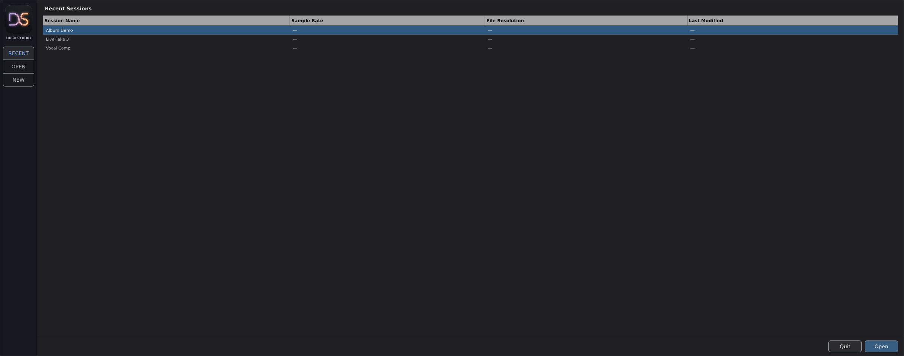

The main window is laid out top to bottom: menu bar, stage selector (RECORDING / MIXING / AUX / MASTERING), bank selector, transport bar, tape strip toggle, console. The console fills the rest of the window with 24 channel strips, 4 buses, and the master.

## Pick an audio device

Open **Settings → Audio…**. Choose your interface, sample rate, and block size. 48 kHz at 256 samples is a safe default; drop to 128 if your hardware can keep up and you need lower monitoring latency.

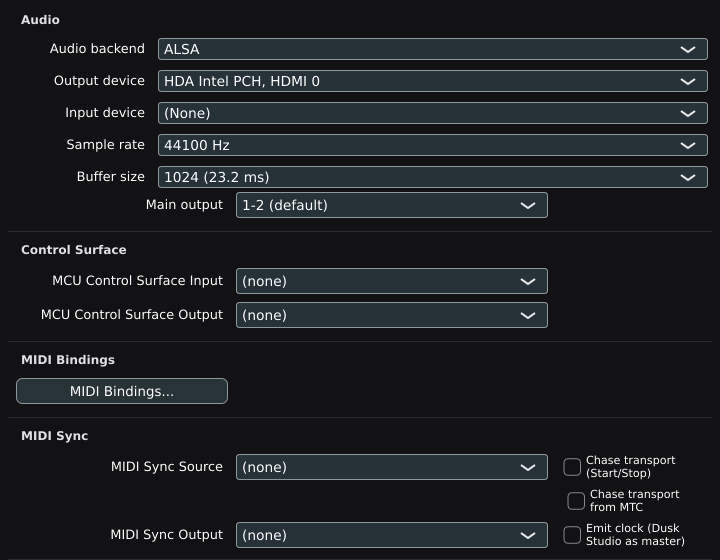

On Linux, PipeWire and JACK both appear as "JACK"; pick whichever owns your interface. On macOS, both Core Audio devices and any AVB / aggregate devices show up. On Windows, ASIO drivers appear ahead of WASAPI.

If your interface has more than two inputs, the channel pickers on each track's input block will populate automatically; no extra routing dialog is needed.

## Arm a track and check levels

Switch to **RECORDING** stage. Click the **ARM** button on track 1. The button lights red and the **Input** picker becomes active. Leave the input on `−2: follow track index` if your guitar is plugged into interface input 1, or pick a specific input if it is somewhere else.

Click **IN** to enable input monitoring. Play the source and watch the input meter on the strip. Use the gain knob on your interface (not the channel fader) to push peaks to roughly −12 dBFS. The strip's clip indicator at the top of the input meter lights red and holds for one second any time you cross 0 dBFS — back off.

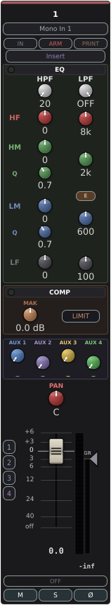

If you want to track _through_ the channel's EQ and compressor, also engage **PRINT**. The recorded file will contain the post-effects signal. With PRINT off (the default) you can tweak EQ and compression after the take without re-recording. PRINT applies to **audio tracks only**; MIDI tracks always record raw MIDI events and ignore the PRINT button.

## Record

Hit **R** or click the transport's record button. Playback starts, the record indicator flashes, and a region begins drawing into the tape strip on track 1. Stop with **Space** when you are done.


If you do not like the take, **Cmd+Z** undoes the recording. The take is preserved in the region's take history (up to 20 takes per region) — right-click the region and pick a previous take to swap it back in.

## Overdub

Disarm track 1. Arm track 2, pick the right input, and record over the playback of track 1. Repeat for as many tracks as you need; Dusk Studio can record 8 inputs at once.


To punch in over a specific section of an already-recorded track, set the punch in and out points (**Shift+[** and **Shift+]**), engage **P** for punch mode, arm the track, and press record before the punch in point. Dusk Studio will start recording at the punch in point and stop at the punch out point automatically.

## Mix

Switch to **MIXING** stage. The input block on each strip collapses into a small `I/O` button, and the aux send knobs replace it. Now you have full visibility of:

- Insert slot (one plugin or one hardware insert per channel).
- HPF / LPF.
- 4-band EQ.
- Compressor (Opto / FET / VCA, picked by right-click on the COMP header).
- Four aux sends (post-fader by default; right-click any send knob to flip pre-fader).
- Pan and fader.
- Bus assigns (right-click the fader area).

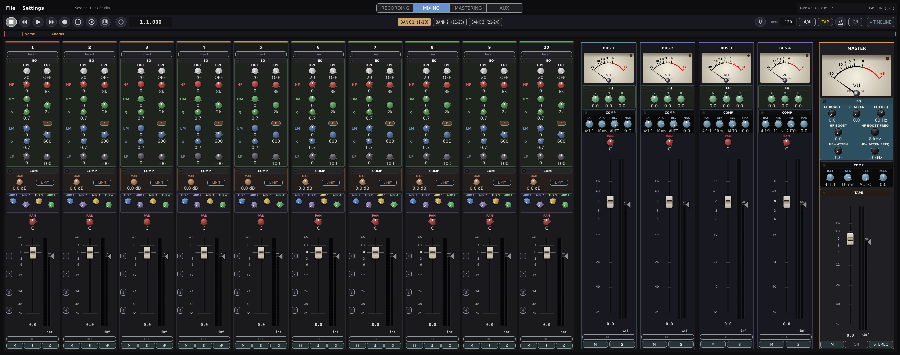

Mix top-down: shape EQ first, then ride the compressor, then balance with faders. Save your aux sends for finishing touches (reverb on aux 1, tape delay on aux 2, etc.).

For console-style automation, click the small mode label below a fader to cycle through OFF / READ / WRITE / TOUCH. WRITE records every move while the transport rolls; TOUCH only writes while you are physically touching the control.

## Bounce

When the mix is where you want it, hit **Cmd+B** to open the bounce dialog. Pick a filename, sample rate, and bit depth. The bounce renders offline as fast as the CPU allows and lands in the session folder by default.

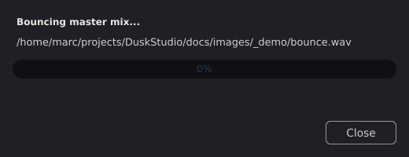

If you want the bounce to also pass through a mastering chain (5-band EQ, multiband compressor, brickwall limiter, LUFS metering), switch to **MASTERING** stage, click **Load latest mixdown** to pull in the bounce you just made, dial the chain in, then **Export master…** to render the final file.

That is the whole loop: arm → record → overdub → mix → bounce. Everything below in this manual is a deeper reference on one of those steps.

\newpage

# Names and Functions of Parts

This chapter is a visual reference. Every numbered callout on the figures below corresponds to a row in the table beneath the figure. If you are looking for "what does this knob do", this is the chapter to skim.

## The main window


| #   | Name              | Description                                                                                                                       |
| --- | ----------------- | --------------------------------------------------------------------------------------------------------------------------------- |
| 1   | Menu bar          | `File` and `Settings` menus only. No tabs, no hidden submenus.                                                                    |
| 2   | Stage selector    | Four buttons: **RECORDING**, **MIXING**, **AUX**, **MASTERING**. Picks which view fills the console area.                         |
| 3   | Bank selector     | `1-8`, `9-16`, `17-24`. Only visible when the window is too narrow to show all 24 channel strips at once.                         |
| 4   | Transport bar     | Play, record, loop, punch, BPM, time signature, clock, tuner. See the next figure for the inventory.                              |
| 5   | Tape strip toggle | `▾ TIMELINE` / `▴ TAPE`. Collapses or expands the timeline view below the bar.                                                     |
| 6   | Console view      | Holds 24 channel strips, 4 buses, and the master strip. Replaced by the aux lane or mastering chain when those stages are active. |

## The transport bar


| #   | Name             | Description                                                                      |
| --- | ---------------- | -------------------------------------------------------------------------------- |
| 1   | Stop             | Halts playback or recording, returns the playhead to bar 1.                      |
| 2   | Rewind           | Short press jumps to the previous marker or bar 1; hold for 10× scrub backwards. |
| 3   | Play             | Toggles playback. Snaps to loop start if loop is on and the playhead is outside. |
| 4   | Forward          | Short press jumps to the next marker; hold for 10× scrub forwards.               |
| 5   | Record           | Toggles record. Requires at least one armed track.                               |
| 6   | Loop             | Toggles loop playback between the loop brackets.                                 |
| 7   | Punch            | Toggles automatic punch in / punch out using the punch brackets.                 |
| 8   | Virtual keyboard | Opens the on-screen MIDI keyboard overlay.                                       |
| 9   | Metronome        | Click on / off. Right-click for the click settings.                              |
| 10  | C/I              | Count-in toggle. One bar of click before record starts.                          |
| 11  | BPM              | Click to type a tempo; drag to nudge.                                            |
| 12  | TAP              | Tap repeatedly to set the tempo from your wrist.                                 |
| 13  | Time signature   | Click to choose. Custom signatures supported.                                    |
| 14  | Clock display    | Bars.Beats.Ticks or mm:ss.mmm; right-click to flip.                              |
| 15  | Tuner            | Opens the chromatic tuner against the selected input.                            |
| 16  | TIMELINE / TAPE   | Same as the tape strip toggle below the bar.                                     |
| 17  | SNAP             | Global grid snap toggle for region edits.                                        |
| 18  | − / + / Fit      | Timeline zoom out / in / fit-to-window.                                          |

In compact mode (window narrower than 1850 px) labels shorten; `SNAP` becomes `S`, `TIMELINE` becomes `▾`, and the time-format toggle hides — right-click the clock display to flip format instead.

## The channel strip — MIXING stage


| #   | Name                | Description                                                                                                 |
| --- | ------------------- | ----------------------------------------------------------------------------------------------------------- |
| 1   | Name                | Click to rename; right-click for the colour palette.                                                        |
| 2   | Insert slot         | One plugin or one hardware insert. 20 ms equal-power crossfade between modes.                               |
| 3   | HPF                 | High-pass filter, 20–300 Hz. LED green when on.                                                             |
| 4   | LPF                 | Low-pass filter, 3 kHz–20 kHz.                                                                              |
| 5   | 4-band EQ           | LF (shelf) / LM (peak) / HM (peak) / HF (shelf). Right-click header to flip between E and G saturation characters. |
| 6   | Compressor          | Opto / FET / VCA, right-click header to switch. GR meter to the left.                                       |
| 7   | Aux 1 send          | Post-fader by default; right-click to flip pre-fader.                                                       |
| 8   | Aux 2 send          |                                                                                                             |
| 9   | Aux 3 send          |                                                                                                             |
| 10  | Aux 4 send          |                                                                                                             |
| 11  | Pan                 | Equal-power, 3 dB centre dip.                                                                               |
| 12  | Fader               | −∞ to +12 dB. Click the dB readout to type; right-click for MIDI Learn.                                     |
| 13  | Mute / Solo / Phase | M (red), S (blue), Ø (yellow). Solo is solo-in-place and additive.                                          |
| 14  | Bus assigns         | Right-click the fader area for the bus menu.                                                                |
| 15  | Meters              | Level meter (left of fader): pre-fader input while monitoring (IN), post-fader output on playback. GR meter (right of comp). |
| 16  | Fader group         | Right-click the strip → **Fader group…** to join one of 8 groups. A coloured **G1…G8** chip appears in the name row.  |

### Fader groups

Assign a strip to one of eight fader groups (right-click the strip → **Fader group…** → *Group 1–8*, or *None* to leave). Members of a group move together: dragging any member's fader — or moving it from a control surface or MIDI — shifts every other member by the same dB amount, so the group's relative balance is preserved. The lowest-numbered track in a group is the **master** and shows a filled chip; the rest show an outlined chip in the same colour. Groups link the **fader only** — mute, solo, and pan stay per-track — and a group can span banks and buses. Group membership is saved with the session.

## The channel strip — RECORDING stage


| #   | Name             | Description                                                                                                   |
| --- | ---------------- | ------------------------------------------------------------------------------------------------------------- |
| 1   | Mode             | **Mono**, **Stereo**, or **MIDI**.                                                                            |
| 2   | Input picker     | Audio device input (mono / stereo), or MIDI port (MIDI). `−2: follow track index` matches input N to track N. |
| 3   | ARM / IN / PRINT | ARM marks for record. IN enables input monitoring. PRINT commits EQ + comp + insert to the recorded file.     |
| 4   | Activity LED     | Blinks green when MIDI arrives on the chosen channel (MIDI mode only).                                        |

## The bus strip

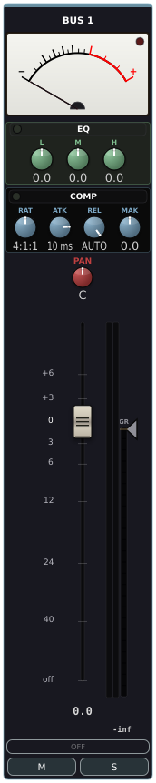

| #   | Name           | Description                                                              |
| --- | -------------- | ------------------------------------------------------------------------ |
| 1   | Name           | Right-click to rename.                                                   |
| 2   | 3-band EQ      | LF shelf / MID peak / HF shelf, ±9 dB per band.                          |
| 3   | Bus compressor | Console-style glue. Threshold, ratio, attack, release, auto-release, makeup. |
| 4   | Pan            | Same equal-power law as channel strips.                                  |
| 5   | Fader          | −∞ to +12 dB.                                                            |
| 6   | Mute / Solo    | Same additive solo-in-place rule as channels.                            |
| 7   | Peak meter     | Post-fader L/R.                                                          |
| 8   | VU meter       | 300 ms RMS, matched to the tape sat's internal VU integrator.            |

## The master strip

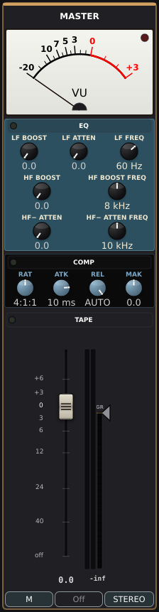

| #   | Name                  | Description                                                                                      |
| --- | --------------------- | ------------------------------------------------------------------------------------------------ |
| 1   | Program EQ            | Tube-saturated low + high program EQ. Right-click for the modal editor.                          |
| 2   | Master bus compressor | Identical DSP to the bus comp, typically used slower.                                            |
| 3   | Tape saturation       | Reel-to-reel model. Oversampling follows the global Effect Oversampling setting (Audio settings). Click for the tape-machine modal; right-click to toggle the tape on/off. |
| 4   | Master fader          | −∞ to +12 dB.                                                                                    |
| 5   | Mono                  | Sums L+R to mono on both legs for phase / single-speaker checks.                                 |
| 6   | Peak meters           | Post-output L/R.                                                                                 |
| 7   | VU meters             | Post-output 300 ms RMS.                                                                          |
| 8   | GR meter              | Master compressor gain reduction.                                                                |

## The AUX view

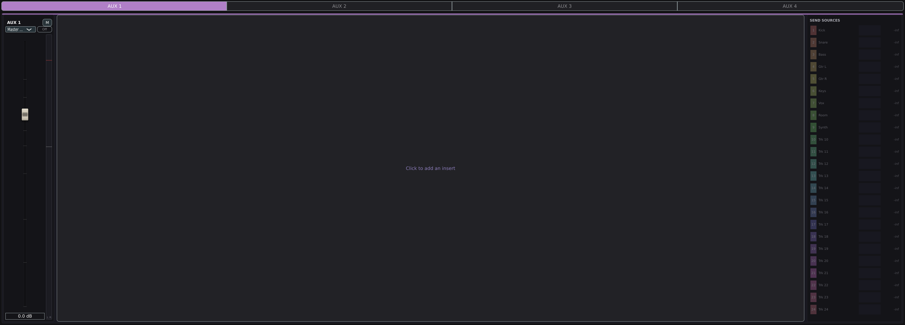

| #   | Name                | Description                                                                         |
| --- | ------------------- | ----------------------------------------------------------------------------------- |
| 1   | Lane selector       | Aux 1 / 2 / 3 / 4 buttons across the top.                                           |
| 2   | Name                | Double-click the lane title to rename.                                              |
| 3   | Mute / Return fader | Mute the entire lane; fader sets return-into-master level.                          |
| 4   | Insert slot         | One plugin or one hardware insert per lane.                                         |
| 5   | Output meter        | Pre-master return level.                                                            |
| 6   | Sources panel       | Every channel currently sending to this aux, with its send level and a small meter. |

## The MASTERING view

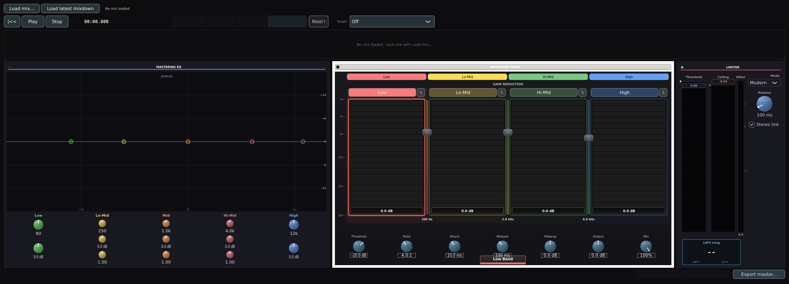

| #   | Name              | Description                                                                                 |
| --- | ----------------- | ------------------------------------------------------------------------------------------- |
| 1   | File picker       | Load any stereo WAV; **Load latest mixdown** grabs the newest bounce in the session folder. |
| 2   | Transport         | Play / stop / loop on the loaded file. Recording is disabled in this stage.                 |
| 3   | Waveform          | Stereo overview with the playhead.                                                          |
| 4   | 5-band digital EQ | Low shelf / 3 peaks / high shelf, ±12 dB per band.                                          |
| 5   | Bus compressor    | Same UniversalCompressor as elsewhere, tuned to mastering defaults.                         |
| 6   | Brickwall limiter | True-peak, 4× oversampled lookahead (see the mastering chapter).                            |
| 7   | Loudness panel    | Momentary / short-term / integrated LUFS + True Peak (4× oversampled, BS.1770).             |
| 8   | Export master…    | Renders the chain offline to a stereo file.                                                 |

## The tape strip

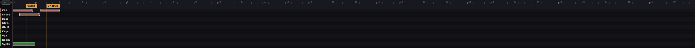

| #   | Name               | Description                                                     |
| --- | ------------------ | --------------------------------------------------------------- |
| 1   | Ruler              | Bars and beats. Right-click for snap denomination.              |
| 2   | Region             | Audio or MIDI clip. Drag to move, drag the edges to trim.       |
| 3   | Region edge handle | Trim handle. Hold Cmd to nudge by snap.                         |
| 4   | Marker             | Drop with **M**, drag to move, right-click to rename or delete. |
| 5   | Loop bracket       | Set with **[** / **]**; enable loop with **L**.                 |
| 6   | Punch bracket      | Set with **Shift+[** / **Shift+]**; enable punch with **P**.    |
| 7   | Snap toggle        | Global on/off mirrored from the transport bar's SNAP button.    |

## The audio region editor

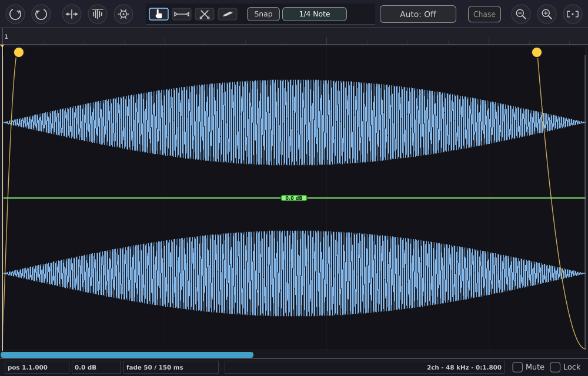

| #   | Name              | Description                                                                     |
| --- | ----------------- | ------------------------------------------------------------------------------- |
| 1   | Waveform          | Region content, with the source-file context dimmed before / after trim points. |
| 2   | Fade handle       | Drag in from each edge to set fade-in or fade-out length.                       |
| 3   | Trim handle       | Region in / out trims (non-destructive).                                        |
| 4   | Gain slider       | ±24 dB region gain.                                                             |
| 5   | Edit-mode toolbar | Grab / Range / Cut / Grid / Draw. Cycle with **G**.                             |

## The piano roll

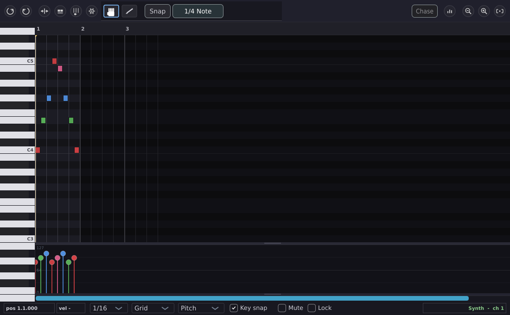

| #   | Name            | Description                                                                       |
| --- | --------------- | --------------------------------------------------------------------------------- |
| 1   | Keyboard        | Click a key to audition the pitch. Scale-highlight non-scale keys dim.            |
| 2   | Note grid       | Click an empty cell to create a note at the active velocity.                      |
| 3   | Selected note   | Velocity shown next to the head. Drag to move; drag edges to trim.                |
| 4   | Velocity strip  | Drag the per-note bars to set velocity per note.                                  |
| 5   | CC lane         | Pick a controller with **L**; draw events with the mouse.                         |
| 6   | Scale highlight | Set root + mode with **S**. Non-scale notes are dimmed in both keyboard and grid. |

\newpage

# Getting started

## System requirements

- **Linux**: PipeWire (recommended) or JACK or ALSA. JUCE 8's JACK backend drives PipeWire transparently.
- **macOS**: 14.4 (Sonoma) or later for the out-of-process plugin sandbox; older macOS still runs plugins in-process.
- **Windows**: Windows 10 or later, ASIO driver recommended.

Any modern multi-core CPU (Intel, AMD, or Apple Silicon) is sufficient for a 24-track session at 48 kHz. The compressor and EQ on every channel are oversampled when the global oversampling factor is raised; expect roughly 2–3× CPU on the mix engine when you select 4× oversampling.

## Installing Dusk Studio

The binaries shipped via Patreon and GitHub Sponsors are **unsigned by design** — Dusk Studio uses no Apple Developer ID and no Windows Authenticode certificate, and neither is planned. The result: macOS Gatekeeper and Windows SmartScreen will warn you on first launch. The warning is expected and the bypass is quick — under 30 seconds per OS — but it is required the first time.

The source on GitHub is GPL-3.0; anyone who prefers to skip the warning can build from source.

### Linux (tarball)

1. Download `dusk-studio-<version>-Linux-<arch>.tar.xz` from the Patreon post or the private releases repo.
2. Extract it in the download folder:
   ```bash
   tar xf dusk-studio-*-Linux-*.tar.xz
   ```
   This unpacks a `dusk-studio-<version>-Linux-<arch>/` directory holding a portable `DuskStudio/` program folder plus `install.sh`.
3. Run it in place — no install required:
   ```bash
   cd dusk-studio-*-Linux-*
   ./DuskStudio/DuskStudio
   ```
4. Or install it for a menu entry, a `DuskStudio` launcher on your `PATH`, and the `session.json` file association:
   ```bash
   ./install.sh                # user install to ~/.local (no root)
   sudo ./install.sh --system  # system-wide to /opt + /usr/local
   ```
   Remove a previous install with `./install.sh --uninstall` (add `sudo` for a system install).

No signing dance. Linux desktops run the binary directly.

### macOS (DMG / .app)

macOS 14 Sonoma and 15 Sequoia ship Gatekeeper at its strictest defaults. Right-click → Open used to bypass; recent macOS releases require a trip to System Settings instead.

1. Double-click the downloaded `DuskStudio.dmg` to mount it.
2. Drag **Dusk Studio.app** to your `Applications` folder.
3. The first time you launch the app, macOS will show: *"Dusk Studio.app cannot be opened because the developer cannot be verified."* Click **OK** to dismiss — this step is required so macOS records the block in your security log.
4. Open **System Settings → Privacy & Security**. Scroll to the bottom.
5. You will see *"Dusk Studio.app was blocked from use because it is not from an identified developer."* Click **Open Anyway**.
6. Enter your administrator password when prompted.
7. macOS shows the warning one more time with an **Open** button — click it.
8. Subsequent launches work normally; macOS only asks once per build.

If you later install a newer build (different binary hash), the bypass dance repeats once for that new build.

**If the icon shows in the Dock but the app never opens (and you have to force-quit):** you are almost certainly launching it from the mounted DMG or your Downloads folder. An ad-hoc-signed app run from a quarantined location can hang at launch on Apple Silicon. Fix: make sure **Dusk Studio.app** is in `/Applications` (step 2) and launch it from there - not from the DMG. If it still hangs, clear the quarantine flag in Terminal, then launch again:

```bash
xattr -dr com.apple.quarantine "/Applications/Dusk Studio.app"
```

### Windows (MSI installer)

Windows SmartScreen blocks unsigned MSIs by default. The bypass is one click but it's hidden behind a small link.

1. Double-click the downloaded `DuskStudio-{version}.msi`.
2. SmartScreen shows: *"Windows protected your PC"* with a **Don't run** button.
3. Click the small **More info** link near the top of the dialog. SmartScreen expands to show *"App: DuskStudio-{version}.msi / Publisher: Unknown publisher"*.
4. A new **Run anyway** button appears at the bottom — click it.
5. The MSI installer runs normally. Accept the install location (`C:\Program Files\Dusk Studio` by default) and finish.
6. Launch Dusk Studio from the Start menu.

Windows SmartScreen treats every new MSI hash as untrusted on first download; reputation builds up across installations over time but reset on every new release. The MORE INFO → RUN ANYWAY two-click bypass is consistent across builds.

### Verifying your download

Every release ships with a `SHA256SUMS.{linux,macos,windows}` file. To verify:

```bash
# Linux + macOS
shasum -a 256 -c SHA256SUMS.linux         # or .macos
```

```pwsh
# Windows PowerShell
Get-FileHash -Algorithm SHA256 DuskStudio-*.msi
# Compare against the published SHA256SUMS.windows.
```

Verification protects against a bit-flipped download or a man-in-the-middle attack on the release attachment. It does NOT verify authorship; that's what the (currently absent) code-signing certificate would do.

## First launch

On first launch Dusk Studio opens a blank session named `Untitled`. The window is divided, top to bottom, into:

- A thin menu bar (File and Settings).
- A row of large coloured buttons for the four stages: **RECORDING**, **MIXING**, **AUX**, **MASTERING**.
- A bank selector (only visible when the window is too narrow to show all 24 channel strips at once).
- The transport bar.
- The tape strip (the timeline view), collapsed by default.
- The console view, showing 24 channel strips (in three banks of 8), 4 buses, and the master strip.

Press **RECORDING** to focus the channel strips on input routing and arm controls. Press **MIXING** to focus them on send levels and inserts. Press **AUX** to see the four aux lanes, their inserts, and their send sources. Press **MASTERING** to load a finished mix and run it through the mastering chain.

## Configuring audio

Open **Settings → Audio…** to choose your audio device. The panel is divided into six sections.

### Audio

- **Device**: lists every backend driver Dusk Studio detected. On Linux, PipeWire and JACK appear as "JACK"; ALSA devices appear separately. On Windows, ASIO is preferred and selected by default when an ASIO driver is present; if none is installed, Dusk Studio falls back to "Windows Audio (Exclusive Mode)" for low latency, then shared "Windows Audio", then "DirectSound". Install your interface's ASIO driver (or ASIO4ALL) for best latency.
- **Sample rate**: any rate the device supports. 44.1 kHz, 48 kHz, 88.2 kHz, 96 kHz are common.
- **Block size**: smaller blocks give lower latency but cost more CPU per sample. 256 or 512 samples is a good starting point.
- **Periods (Linux/ALSA only)**: how many buffers the ALSA driver keeps in flight. Two is the lowest-latency safe value; three or more is more robust on a busy machine.
- **Rescan devices**: re-enumerates every backend, useful if you plugged in a USB interface after launch.

### Control surface

- **MCU input** and **MCU output**: pick the MIDI ports your Mackie Control surface is connected to. Selecting both enables motorised-fader feedback and LED state mirroring.

### MIDI bindings

A single button opens the **MIDI Bindings** panel, which lists every CC-to-control mapping you have learned. You can remove any binding, clear them all, or export and import a binding preset as JSON.

### MIDI sync

- **Sync source input**: the MIDI input port to chase Clock or MTC from. Choose `(none)` to disable chase.
- **Chase transport (Start/Stop)**: enables transport chase on MIDI Start (FA) and Stop (FC).
- **Sync output**: the MIDI output port to emit Clock or MTC on.
- **Emit clock**: emit 24 PPQN MIDI Clock when Dusk Studio is playing.
- **Chase MTC**: chase SMPTE position from incoming MIDI Time Code quarter-frame messages.
- **Emit MTC**: emit MTC quarter-frame messages.
- **MTC frame rate**: 24, 25, 29.97 drop-frame, or 30 frames per second.

### General

- **UI scale**: a global zoom factor for the entire interface. Restart Dusk Studio after changing this for best results.
- **Expand tape strip by default**: show the tape strip on every session open.
- **Scan plugins on startup**: re-run the plugin scanner every time Dusk Studio launches. Off by default; large plugin collections take 10–30 seconds to scan.

### Advanced

- **Effect oversampling**: 1×, 2×, or 4×. Raises the internal sample rate of every channel EQ and compressor, every bus EQ and compressor, the master EQ and compressor, and the mastering EQ and compressor. Reduces aliasing on saturation stages at the cost of CPU. Tape saturation has its own internal oversampling controlled separately.
- **Run self-test**: runs Dusk Studio's headless audio engine against a synthetic test signal and reports pass/fail.

\newpage

# The interface

## Window layout

The window is structured as a stack of horizontal bands.

```
┌───────────────────────────────────────────────────────┐
│ File   Settings              Session name      CPU…   │  Menu bar
├───────────────────────────────────────────────────────┤
│  RECORDING   MIXING   AUX   MASTERING                 │  Stage selector
├───────────────────────────────────────────────────────┤
│  1-8   9-16                                           │  Bank selector
├───────────────────────────────────────────────────────┤
│ ◀◀  ▶  ▶▶  ●  ⟳  ◉   CLK ♩=120 4/4 00:01:23  SNAP ⊕⊖│  Transport bar
├───────────────────────────────────────────────────────┤
│  ▾ TIMELINE                                            │  Tape strip toggle
├───────────────────────────────────────────────────────┤
│                                                       │
│      [ ConsoleView, AuxView, or MasteringView ]       │
│                                                       │
└───────────────────────────────────────────────────────┘
```

Modal dialogs (audio settings, plugin picker, region editor, piano roll, import target picker) appear centered with a dimmed backdrop behind them. Press **Esc** or click outside the modal to dismiss.

## The four stages

Only one stage is visible at a time, but the same engine drives all four. Switching stages is purely a UI change; audio keeps flowing.

- **RECORDING** shows each channel strip's input source, arm button, monitor toggle, and "print" toggle (for whether EQ and compression are committed to the recorded file or kept live).
- **MIXING** replaces the input block with the channel's four aux send knobs. Inserts and EQ stay on screen.
- **AUX** swaps the console view for the four aux return lanes, with a full-width view of each lane's plugin chain.
- **MASTERING** swaps the console view for the mastering chain, including a file picker for loading a finished mix.

Switching into or out of MASTERING force-stops the transport. The mix engine and the mastering engine cannot run at the same time.

## The transport bar

From left to right:

- **Stop** (■). Halts playback or recording, returns the playhead to bar 1.
- **Rewind** (◀◀). Brief press jumps to the previous marker; if there is no previous marker, jumps to bar 1. Hold for more than 180 milliseconds to scrub backwards at 10× speed.
- **Play** (▶). Toggles play. If loop is enabled and the playhead is outside the loop region, the playhead snaps to the loop start before playback begins.
- **Forward** (▶▶). Brief press jumps to the next marker (no overshoot past the last one). Hold to scrub forward at 10× speed.
- **Record** (●). Toggles record. Requires at least one track armed.
- **Loop** (⟳). Toggles loop playback.
- **Punch** (◉). Toggles punch recording. Right-click to enable/disable pre-roll and post-roll and set their seconds.
- **Virtual keyboard** (⌨). Opens an on-screen MIDI keyboard.
- **Metronome** (♩). Toggles the click. Right-click for click settings.
- **C/I**. Toggles count-in (one bar of click before record starts).
- **BPM**. Click to type a tempo; drag up or down to nudge. Changing BPM while MIDI regions exist prompts for confirmation, because tick positions are interpreted relative to BPM.
- **TAP**. Click on each beat; Dusk Studio averages the last four intervals over a two-second window and sets the tempo.
- **Time signature**. Click to choose from common signatures or enter a custom one.
- **Clock display**. Shows the current playhead position. Right-click to flip between **Bars.Beats.Ticks** (e.g. `5.2.120`) and **mm:ss.mmm** (e.g. `01:23.456`).
- **Tuner**. Opens a chromatic tuner that listens to the selected input.
- **▾ TIMELINE / ▴ TAPE**. Collapses or expands the tape strip below the console.

On the right end of the transport bar:

- **SNAP**. Global grid snap toggle. When on, region drags, trims, and pastes snap to the snap denomination set in the edit-mode toolbar.
- **−** / **+** / **Fit**. Timeline zoom out, in, and fit-to-window.

In compact mode (window narrower than 1850 pixels), labels shorten: `SNAP` becomes `S`, `TIMELINE` becomes `▾`, and the time-format toggle hides — right-click the clock display to flip format instead.

\newpage

# The channel strip

Every track is processed by an identical channel strip. The order is fixed; you cannot reorder blocks. From top to bottom of the signal flow:

<!-- Source: src/dsp/ChannelStrip.cpp::processAndAccumulate
     Stages: phase invert (:471, :628) → insert (:487, :643) →
             EQ incl. HPF + LPF (:533, :572, :678, :707) →
             compressor (:561, :582, :697, :717) →
             pan + fader + bus/master/aux branching (:796–:861).
     Verify on any DSP-order change. -->

```text
input → phase invert → insert (plugin OR hardware) → HPF → 4-band EQ →
LPF → compressor → pan → fader ─┬─► master    (when no bus is assigned)
                                 ├─► bus 1..4  (exclusive with master:
                                 │              a bus assignment removes
                                 │              the direct master send)
                                 └─► aux 1..4 sends
                                       (each send is independently pre-fader
                                       or post-fader)
```

Mute, Solo, and the input-monitor (IN) toggle gate the entire accumulation — when the track is muted or soloed-out, nothing reaches master, bus, or aux.

This is the order the audio actually flows. On screen, controls are arranged for ergonomics — the fader is at the bottom, the EQ in the middle — but the underlying chain never changes.

## Track name and colour

Click the name label at the top of the strip to rename the track. Right-click to choose a colour from the 12-hue palette or open a custom colour picker. The colour appears as the strip's accent and on every region that track owns in the tape strip.

## Input block (RECORDING stage)

This block is only visible in the RECORDING stage. In other stages it collapses into a single small **I/O** button you can click to reopen it.

- **Mode**: **Mono**, **Stereo**, or **MIDI**. Determines whether the track records one audio channel, two audio channels, or MIDI events.
- **Input** (Mono mode): the audio device input to record from. The default `−2: follow track index` means track 1 reads device input 1, track 2 reads device input 2, and so on. Choose a specific input to override.
- **Input L / Input R** (Stereo mode): the left and right device inputs.
- **MIDI port** (MIDI mode): which MIDI input to record from.
- **MIDI channel** (MIDI mode): **Omni** (all 16 channels) or a single channel filter.
- **MIDI output** (MIDI mode): optional external MIDI output to drive a hardware synth as you play.
- **Activity LED**: blinks green when MIDI arrives on the chosen channel.

## ARM, IN, PRINT (RECORDING stage)

- **ARM**: light red when on. Marks the track for recording on the next Record press.
- **IN**: input monitor. When on, you hear the live input through the channel strip. Useful for tracking with effects.
- **PRINT** (audio tracks only): when on, the channel's EQ, compressor, and insert are committed to the recorded file. When off (the default), they are kept live, so you can tweak them after the take. MIDI tracks ignore PRINT — they always record raw MIDI events; the instrument plugin's audio is rendered on playback, not on capture, so there is nothing to "print to disk" for a MIDI track.

## Insert slot

Each channel has one insert slot, which can hold either a plugin or a hardware insert (configured via the Settings or right-click menu). Switching between plugin and hardware uses a 20-millisecond equal-power crossfade, so the change is inaudible.

- Click **+ Plugin** to open the plugin picker.
- Right-click the slot for **Add / Replace / Remove / Edit / Configure as hardware insert**.
- When a plugin is loaded, the slot shows its name. Click to open the editor.

The insert sits **before** the HPF, so any plugin you load drives the rest of the channel's tone shaping.

## HPF (high-pass filter)

- **Enable**: click the label to toggle. The LED lights green when on.
- **Frequency**: 20 to 300 Hz. At 20 Hz the filter is effectively bypassed (the LED stays unlit until you drag above 20 Hz).

A modest HPF (60–80 Hz on vocals, 100 Hz on most instruments, 30 Hz on bass) cleans up rumble before it hits the EQ.

## LPF (low-pass filter)

- **Enable**: toggle as for HPF.
- **Frequency**: 3 kHz to 20 kHz. At 20 kHz the filter is effectively bypassed.

Useful for taming hi-hat bleed, cymbal harshness on a mic that's picking up too much top, or muffling a track you want pushed to the back of the mix.

## 4-band parametric EQ

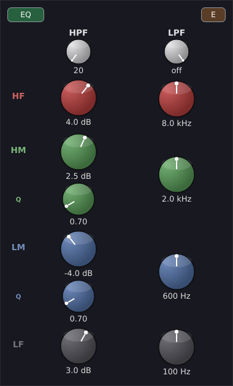

A British console-style 4-band EQ. Left-click the **EQ** header to enable; the LED lights green. Right-click to choose the saturation character:

- **E** (brown, default): brown character — slightly more aggressive midrange.
- **G** (black): black character — smoother high band.

The four bands are:

| Band   | Type       | Freq range    | Default freq | Gain   | Q range |
| ------ | ---------- | ------------- | ------------ | ------ | ------- |
| **LF** | Low shelf  | 20–400 Hz     | 100 Hz       | ±15 dB | n/a     |
| **LM** | Peaking    | 100 Hz–4 kHz  | 600 Hz       | ±15 dB | 0.4–4.0 |
| **HM** | Peaking    | 600 Hz–13 kHz | 2 kHz        | ±15 dB | 0.4–4.0 |
| **HF** | High shelf | 1–20 kHz      | 8 kHz        | ±15 dB | n/a     |

Each knob is a rotary slider. Drag up to increase, down to decrease. Use a vertical drag for gain, a horizontal drag for frequency. There are no numeric text boxes on the knobs; the values display below.

EQ in Dusk Studio does **not cramp** near Nyquist; the British EQ does its own internal pre-warping and benefits further when the global oversampling is raised.

## Compressor

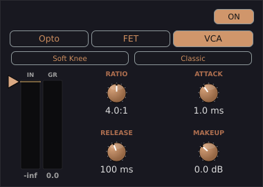

The channel compressor has three mutually-exclusive modes. Settings are remembered per mode — switch from FET back to Opto and your Opto settings are exactly as you left them.

Left-click the **COMP** header to enable. Right-click to pick **Opto**, **FET**, or **VCA**.

All three modes share one set of knobs — **THRESHOLD, RATIO, ATTACK, RELEASE, MAKEUP** — that route to the right underlying parameter for whichever mode is active. Set the **threshold** by dragging the triangle handle on the gain-reduction meter strip (this also engages the compressor); the remaining knobs sit in a 2×2 grid below the header. The **MAKEUP** knob is the shared makeup gain (−12 to +24 dB) and is available in every mode. Knob ranges retune per mode, as listed below.

### Opto (optical style)

A program-dependent optical compressor. Only **threshold** (shown as **PEAK RED**) and **MAKEUP** are adjustable — ratio, attack, and release are fixed by the optical model and are hidden in this mode.

The Opto's character is slow attack, slow release, and a frequency-dependent gain reduction curve that is gentle in the lows and firmer in the mids and highs. Good on vocals, bass, and any source where you want compression to be felt but not heard.

### FET (classic FET style)

A fast solid-state compressor. The full grid is available:

- **Threshold**: −60 to 0 dB.
- **Ratio**: a stepped selector — **4:1**, **8:1**, **12:1**, **20:1**, **All** (the all-ratios-engaged "all-in" mode — extremely aggressive, almost a distortion effect).
- **Attack**: 0.02 to 80 ms.
- **Release**: 50 to 1100 ms.

Classic FET compressors had no threshold control; Dusk Studio's FET exposes one so its UX matches the other modes, while the characteristic transformer/harmonic colour stays baked into the model. The FET is the right tool for drums, electric guitar, and anything where you want compression to be heard. The "All" setting is famously useful on parallel drum buses.

### VCA (Classic 160-style)

A clean, fast, full-featured compressor.

- **Threshold**: −38 to +12 dB. Above this, compression begins.
- **Ratio**: 1:1 to 120:1.
- **Attack**: 0.1 to 50 ms.
- **Release**: 10 to 5000 ms.
- **Soft Knee**: when on, a parabolic (soft) knee replaces the hard knee.
- **Detector**: **Adaptive** (default, level-dependent RMS time constant from 35 ms down to 5 ms) or **Classic** (fixed 10 ms RMS).

The soft-knee and detector toggles appear only in VCA mode. The sidechain has a built-in 60 Hz high-pass filter in VCA mode (so bass doesn't pump the compressor); Opto and FET have it disabled by default to preserve their period-correct character.

The gain-reduction meter (the thin vertical bar to the left of the comp section) shows real-time reduction in dB, regardless of mode.

## Aux sends (MIXING stage)

In the MIXING stage the input block is replaced by four send knobs, one per aux lane. Each knob is colour-matched to its destination aux.

- **Range**: −60 to +6 dB, or **OFF** (−100 dB, the bottom of the knob's travel).
- **Pre / post fader**: right-click the knob to toggle. Post-fader is the default.

Pre-fader sends are used for headphone cue mixes: the singer can hear their voice at the same level even when you pull their fader down. Post-fader sends are used for effects: when you pull the channel fader down, the reverb level falls with it.

## Pan

A rotary knob. Centre is unity; full left is −1.0, full right is +1.0. The pan law is equal-power, with a 3 dB centre dip on each leg so that panning a mono source from left to right keeps perceived loudness constant.

Stereo tracks pan by adjusting the balance between L and R channels rather than by re-summing. A hard-left pan on a stereo track silences the R channel.

## Fader

A vertical fader with a range of **−∞ dB** (true mute, below −90 dB floor) to **+12 dB**. Unity is at 0 dB.

- Drag the fader to ride the level.
- Click the dB readout beneath the fader to type a precise value.
- Right-click to enter MIDI Learn mode (the next CC you move binds to this fader).

The fader is automatable. The automation modes are **OFF** (no automation), **READ** (play back recorded automation), **WRITE** (record automation continuously while transport rolls), and **TOUCH** (record while you are touching the control; revert to read when you release). Click the small mode label below the fader to cycle, or right-click to pick from a menu.

## Mute, Solo, Phase

Below the fader:

- **M** (mute). Lights red when on.
- **S** (solo). Lights blue when on. Solo is **solo-in-place, additive**: every un-soloed track is muted while any track is soloed; soloing multiple tracks plays them all together. There is no PFL or AFL mode in v1.
- **Ø** (phase invert). Lights yellow when on. Inverts the polarity of the channel's audio before the insert.

## Bus assigns

Each channel can be routed to any combination of the four mix buses. Right-click the fader area for a bus-assign menu. Bus routing is **exclusive with the master send**: as soon as a channel is assigned to one or more buses, its direct send to master is removed and the signal reaches master only via the bus (which sums into master through its own fader and processing). With every bus deassigned, the channel sends directly to master as normal. This prevents the same signal arriving at master twice (once direct, once via the bus) and the +3 dB doubling that would otherwise occur.

## Meters

- **Level meter** (left of the fader): peak level in dBFS, with a brief peak-hold and a numeric readout below it. Two columns for stereo tracks. It follows what you're monitoring — **pre-fader input** while the track is input-monitoring (IN engaged), so you set record levels correctly, and **post-fader output** (the track's contribution to the mix) on playback. Bus and master meters are always post-fader output.
- **GR meter** (right of the fader): real-time compressor gain reduction.

A short red bar at the top of the input meter indicates a clip on that track. The bar holds for one second before clearing.

\newpage

# The bus strips

Between the channel strips and the master strip are four bus strips. They are smaller than the channels but follow a similar grammar. Like the channel strips, each bus has an automation-mode button (OFF / READ / WRITE / TOUCH) in a thin row above its mute/solo buttons; it automates the bus fader, pan, and mute.

## Signal flow

<!-- Source: src/dsp/BusStrip.cpp::processInPlace
     EQ (:195, :214) → comp (:204, :223) → pan × fader (:236–:240).
     Mute is applied at AudioEngine sum-into-master, not inside BusStrip. -->

```text
bus input (sum of assigned channels) → 3-band EQ → bus compressor →
pan → fader → master   (mute and solo gate the sum into master)
```

## 3-band EQ

A simplified British EQ with three bands at fixed musical defaults. Gain range is ±9 dB per band (a Mixbus-style restrained range — buses don't need wide cuts and boosts).

- **LF**: low shelf.
- **MID**: peaking.
- **HF**: high shelf.

## Bus compressor

A console-style glue compressor.

- **Threshold**: −30 to +15 dB.
- **Ratio**: 1:1 to 10:1. 4:1 is the default.
- **Attack**: 0.1 to 50 ms.
- **Release**: 50 to 1000 ms.
- **Auto release**: on by default. Switches the release to a hardware-style program-dependent 150–450 ms envelope.
- **Makeup**: −10 to +20 dB.

A 2:1 ratio with a 10 ms attack and auto-release is a classic drum-bus setting. A 4:1 with a slower attack glues a full mix.

## Pan, fader, mute, solo

Identical in function to the channel strip versions. Bus solos follow the same additive solo-in-place rule.

## Meters

Each bus shows a post-bus peak meter (L and R) plus a slim VU-style RMS meter integrated at 300 ms, matched to the tape saturation's internal VU integrator. The compressor's gain-reduction meter is visible alongside the bus comp section.

\newpage

# The master strip

The rightmost strip. Receives the sum of every channel that is not routed exclusively through a bus, plus every bus's output, plus every aux return.

## Signal flow

<!-- Source: src/dsp/MasterBus.cpp::processInPlace
     program EQ (:218, :242) → bus comp (:227, :251) →
     tape (:277) → fader (:296) → mono sum (:299–:303). -->

```text
master input → program EQ → master bus compressor → tape saturation → master fader → mono sum → output
```

## Tape saturation

Models a small reel-to-reel tape machine.

- **Open the editor**: left-click the **TAPE** header to open the full tape-machine modal editor, where drive, saturation, and tape-character controls live.
- **Bypass / engage**: right-click the **TAPE** header to toggle the tape stage in or out of the signal path.
- **Oversampling**: tape oversampling follows the engine-wide **Effect Oversampling** setting in the Audio Device panel — it is not a per-stage toggle.

Tape saturation is the right tool to glue a mix together. A light application thickens the low-mids, rounds the transients, and adds a touch of harmonic colour.

## Program EQ

A passive-style tube program equaliser.

- **LF Boost** and **LF Atten**: a low shelf with separately controllable boost and cut. The classic boost-and-cut trick — boosting and cutting at the same low frequency — creates a notch above the boost band and a slight bass lift.
- **LF Boost Freq**: 20, 30, 60, or 100 Hz.
- **HF Boost**: a peaking boost band, 0–10 scale.
- **HF Boost Freq**: 3, 4, 5, 8, 10, 12, or 16 kHz.
- **HF Bandwidth**: Sharp (0) to Broad (10). 0.5 is the default.
- **HF Atten**: a high-shelf cut, 0–10 scale.
- **HF Atten Freq**: 5, 10, or 20 kHz.
- **Output**: ±12 dB.

The program EQ is tube-saturated; pushing the boosts harder adds harmonic content rather than just a clean gain change.

## Master bus compressor

Identical in DSP to the bus-strip compressor but typically used with slower settings: a 10 ms attack, auto-release, 2:1 to 4:1 ratio, and 1–3 dB of gain reduction on peaks. Click the **COMP** header to enable.

## Master fader

Same range as channel and bus faders: −∞ to +12 dB.

## Mono

A small **MONO/STEREO** button below the master fader. When pushed, the master output is summed to mono on both channels. Use this to check that your mix translates to a single-speaker environment without phase cancellations.

## Output meters

Two peak meters (L and R) plus two RMS VU meters. The compressor's gain-reduction meter is at the bottom of the comp section.

\newpage

# Aux lanes

The **AUX** stage swaps the console view for a single full-width aux lane. Four selector buttons at the top choose which aux you are looking at.

## Aux lane layout

Each lane is divided into three columns:

```
┌─────────┬───────────────────────────────┬──────────────┐
│ Return  │  Plugin / hardware insert      │  Sources     │
│ strip   │  chain                         │  panel       │
│ (M, ▲)  │                                │              │
└─────────┴───────────────────────────────┴──────────────┘
```

### Return strip (left column)

- **Name** label. Double-click the lane's top title to rename.
- **Mute** button.
- **Return fader**: −∞ to +12 dB. This is the level of the aux's processed output into the master.
- **Output meter**: pre-master return level.
- **Automation mode**: same OFF / READ / WRITE / TOUCH cycle as channel faders.

### Plugin chain (centre column)

Each aux lane has one insert slot. Click **+ Plugin** to open the picker. Right-click for **Add / Replace / Remove / Edit / Configure as hardware insert**. The slot can hold a plugin or a hardware insert, mutually exclusive, with a 20 ms crossfade between modes.

Common uses:

- Reverb on aux 1.
- Tape delay on aux 2.
- Mid-side analog summing through a hardware EQ on aux 3.
- Headphone-cue chorus on aux 4.

### Sources panel (right column)

Lists every channel that is sending to this aux, with its send level and a small meter. Useful for debugging "where is that signal coming from?" and for adjusting cue mixes in one place.

\newpage

# The mastering stage


The **MASTERING** stage is a separate signal path. It does not play your tracks; it plays a single stereo audio file through a dedicated mastering chain. Switching into or out of MASTERING force-stops the transport, because the mix engine and the mastering engine cannot run simultaneously.

## Loading a mix

- **Load mix…**: opens a file chooser. Pick any WAV, AIFF, FLAC, or OGG file.
- **Load latest mixdown**: automatically loads the most recently exported bounce from the current session's bounce folder.

The source file path is displayed below the buttons.

## Transport

A miniature transport bar with **Play**, **Stop**, **Rewind**, a clock display, and a gain-reduction readout summing the compressor and limiter. The **spacebar** toggles play/stop of the loaded mix (it drives the mastering player here, not the multitrack transport).

## Waveform

A full-width audio thumbnail of the loaded file. Click anywhere on the waveform to seek. The playhead is a vertical line.

## Mastering chain

Three columns of DSP, each with its own enable toggle:

### Digital 5-band EQ

A clean linear-phase-style mastering EQ.

| Band | Type       | Default freq | Gain   | Q       |
| ---- | ---------- | ------------ | ------ | ------- |
| 0    | Low shelf  | 80 Hz        | ±12 dB | n/a     |
| 1    | Peaking    | 250 Hz       | ±12 dB | 0.4–4.0 |
| 2    | Peaking    | 1 kHz        | ±12 dB | 0.4–4.0 |
| 3    | Peaking    | 4 kHz        | ±12 dB | 0.4–4.0 |
| 4    | High shelf | 12 kHz       | ±12 dB | n/a     |

### Bus compressor

The same UniversalCompressor in Bus mode as the channel / master compressors, but tuned to mastering defaults: 2:1 ratio, 30 ms attack, 250 ms release, auto-release on. Apply 0.5–2 dB of gain reduction to glue a final mix without squashing transients.

### Brickwall limiter

A true-peak brickwall limiter with lookahead. **Enabled by default.** It runs the whole limiting process at 4× oversampling, so the ceiling holds on inter-sample peaks, not just sample peaks.

- **Ceiling**: −12 to 0 dB. Default **−0.3 dB** (matches the headroom expected by most streaming platforms).
- **Drive**: 0 to +20 dB pre-limiter gain. Drives the input harder for more limiting.
- **Release**: 50 to 300 ms.
- **Mode**: shapes the hold + release character — **Modern** (balanced default), **Transparent** (fast recovery, minimal pumping), **Punchy** (longer hold, denser).
- **Stereo link**: on (default) matches the gain reduction across L/R to preserve the stereo image; off limits each channel independently.

The lookahead adds a small, fixed latency that the engine compensates for. True-peak control is to 4× resolution; for very-high-frequency masters reserve a little extra ceiling headroom.

## Loudness metering

Right of the chain are three loudness readouts:

- **Momentary LUFS** (400 ms window).
- **Short-Term LUFS** (3 second window).
- **Integrated LUFS** (entire program, gated per BS.1770).
- **True Peak (dBTP)** (4× oversampled).

A streaming-platform preset picker (Spotify, Apple Music, YouTube, Netflix, etc.) colour-codes the integrated LUFS and true-peak readings according to that platform's target. Pressing **Reset integrated** clears the integrated reading so you can re-measure from a known point.

## Exporting the master

**Export master…** renders the mastering chain offline to `master.wav` in the session folder. A progress dialog shows the output path and a bar; the render runs as fast as the CPU allows and you can cancel mid-render. The output is **stereo 24-bit WAV at the current device sample rate** (Dusk Studio does not offer per-export format options in v1).

\newpage

# Recording

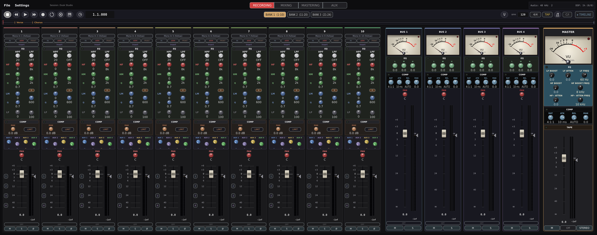

The recording workflow in Dusk Studio is intentionally simple. There are five steps.

1. Switch to the **RECORDING** stage.
2. Choose each track's input source.
3. Click **ARM** on every track you want to record.
4. Optionally enable count-in, punch, or loop.
5. Press **Record** on the transport.

## Setting the input

For an audio track, the **Input** dropdown lists every input channel on your audio device, plus the special default `−2: follow track index`. The default makes track 1 read input 1, track 2 read input 2, and so on — useful when you're tracking a band live and you have wired the patch bay one-for-one.

For a stereo track, you select two inputs (left and right) independently.

For a MIDI track, you select a MIDI input port and a channel filter. The activity LED next to the input blinks each time a MIDI message arrives, so you can confirm your controller is talking to the right track.

## Arming a track

Click **ARM**. The button lights red. Until at least one track is armed, pressing Record on the transport does nothing.

## Monitor mode

Click **IN** to monitor the live input through the channel strip. When the IN light is on, you hear yourself in real time, processed by the channel's EQ and compressor (and any plugin you have loaded on the insert).

## Print mode

When you record an audio take, you choose whether to print the channel processing — EQ, compressor, **and any insert plugin** — to disk or keep it live. Click **PRINT** to commit it; leave it off to record dry and shape the take later. The default is off (dry recording), which is the more flexible choice — it lets you re-EQ, re-compress, and re-process in mixing without re-recording.

## Count-in

Toggle **C/I** on the transport bar. The next time you press Record, the metronome will click for one full bar before recording actually starts. The playhead rolls back by one bar so that the first recorded sample lines up with the intended start position.

The count-in always uses the metronome click, even if you have the click disabled for normal playback.

## Punch recording

To overdub a specific section without erasing material before or after:

1. Set the **punch in** and **punch out** points by clicking the timeline ruler at the desired in and out positions, holding **Shift**.
2. Click the **Punch** button on the transport bar.
3. Right-click the **Punch** button to set the **pre-roll** seconds (how much existing material plays back before the punch-in) and the **post-roll** seconds (how long the transport keeps rolling past the punch-out before auto-stopping). Each has an enable toggle in the same menu, so you can switch a roll off without losing its seconds value. Post-roll defaults to 0 (off).
4. Press Record. Playback begins at the pre-roll position. Recording begins exactly at the punch-in sample and ends exactly at the punch-out sample. The audio before and after is untouched.

When the new take begins, a 64-sample raised-cosine fade-in shapes its edge against the existing material. When the new take ends, a 64-sample fade-out shapes the other edge. The result is a click-free splice.

## Loop recording

To repeat a section while you experiment:

1. Set the loop region with the **[** and **]** keys at the desired in and out positions.
2. Click the **Loop** button on the transport bar.
3. Press Play (for loop playback) or Record (for loop recording).

In loop play, the transport wraps at the loop boundary indefinitely. In loop record, playback wraps but recording stays linear — you get a single take that extends from the loop start to wherever you press Stop. There is no take-stacking loop recording in v1.

## Where files are saved

When you save a session, Dusk Studio creates a folder structure:

```
MySession/
├── session.json
└── audio/
    ├── track01_20260526-143025.wav
    ├── track02_20260526-143025.wav
    └── ...
```

Every recorded audio file is a **24-bit WAV** at the session's sample rate. Filenames include the track number and a timestamp so re-recording the same track on the same day still produces distinct files.

MIDI tracks do not produce separate files; their note and CC data is embedded in `session.json`.

## Take history

Each region keeps a stack of up to **20 previous takes**. When you record a new take whose timeline range fully contains an existing region, the existing region is pushed onto that stack. Partially-overlapping takes are not absorbed — they stay visible on either side of the punch.

To cycle through takes:

- Press **Alt+T** for next take.
- Press **Alt+Shift+T** for previous take.

Or click the take badge on the region itself (visible when more than one take exists).

The 20-take cap bounds memory and disk growth across long sessions.

## Recording errors

If Dusk Studio can't open a file for writing (full disk, permission denied, missing audio directory), the error is captured at record start and displayed as an alert before the take begins, listing the affected tracks. You don't lose a take thinking it was captured.

If something goes wrong mid-take (ring-buffer overrun on a stressed disk, MIDI FIFO overflow), an alert appears when you press Stop. The portion of the take that was written successfully is preserved.

\newpage

# The tape strip


The tape strip is Dusk Studio's timeline view. It is collapsed by default. Click **▾ TIMELINE** at the top right of the transport bar (or the small drawer-handle below the bar) to expand it.

When expanded, the channel strips automatically compact so that the timeline gets vertical space. EQ and compressor controls collapse into header buttons; click a header to open a modal editor with the full controls.

## Layout

```
            time ruler  | ◀ playhead
┌──────────┬─────────────────────────────┐
│ Track 1  │ ▓▓▓▓▓▓░░░░░  ▓▓▓▓▓▓▓▓░░░░░░ │
│ Track 2  │ ░░░  ░░░░░░  ▓▓▓▓▓▓▓▓▓▓▓░░ │
│ Track 3  │           ░░░░  ░░░  ░░░░░ │  (MIDI region)
│ Track 4  │ ▓▓▓▓▓▓▓▓▓▓▓░░░░  ░░░░░░░░░ │
└──────────┴─────────────────────────────┘
```

The left column shows each track's number, colour, and small ARM/SOLO/MUTE buttons. The right area is the timeline canvas.

## The ruler

The top band shows bars and beats (when the clock display is in Bars mode) or minutes and seconds (when in Time mode). Below the bar/beat band is a pill row showing markers and loop/punch brackets.

Click the ruler to seek the playhead. Drag with Shift held to set the loop range.

## Regions

Each region is drawn as a rounded coloured rectangle. Audio regions show a waveform thumbnail; MIDI regions show a piano-keyboard glyph and the first few notes. The region's left edge is its start position; the right edge is start + length.

### Selecting and moving

- Click a region to select it. Other regions deselect.
- **Cmd+click** (Linux/Mac) or **Ctrl+click** (Windows) toggles selection — useful for moving multiple regions together.
- Drag a region body to move it. With **SNAP** on, it snaps to the grid resolution.
- Drag the left or right edge to trim.
- Drag the pink fade discs in the top corners to set fade-in / fade-out lengths.
- Middle-mouse-drag pans the timeline left or right.

### Splitting

Position the playhead and press **T** to split the selected region at the playhead. Or right-click and choose **Split**.

### Duplicating

**Cmd+D** clones the selected region and places the copy immediately after the original.

### Nudging

**Cmd+←** / **Cmd+→** nudges the region by one beat. Hold **Shift** to nudge by a bar.

### Right-click menu

A right-click on any region shows a context menu:

- **Loop region**: set the transport loop to span the region's boundaries.
- **Split at playhead**.
- **Join selected regions** (enabled when two or more regions are selected): glue them into one.
- **Label**: type a custom name.
- **Mute** the region (silences it without deleting it).
- **Lock** the region (prevents accidental edits).
- **Takes** submenu (when more than one take exists on the region).
- **Color**: a palette of 8 accent hues plus **Reset to track colour**.
- **Delete**.

Reverse and Normalize are not on this menu — they live in the audio region editor (double-click the region).

### Take cycling

Right-click a region to see a take submenu (if more than one take exists), or use **Alt+T** / **Alt+Shift+T** to cycle.

## Markers

Press **M** to drop a marker at the current playhead. A marker pill appears in the ruler's lower band.

- Drag a marker pill to move it.
- Right-click for **Rename** and **Delete**.
- **Rewind** and **Forward** transport buttons jump to the previous and next marker.

## Loop and punch brackets

When **Loop** or **Punch** is enabled, coloured brackets appear in the ruler.

- **Cyan**: loop start and loop end.
- **Red**: punch in and punch out.

Drag the bracket ends to adjust. The keyboard shortcuts **[** and **]** set the loop in and out at the current playhead. Hold **Shift** to set punch in and out instead.

## Zoom

- **−** / **=** (or **+**): zoom out, zoom in.
- **0**: zoom to fit the entire timeline width.
- **Cmd/Ctrl+mouse wheel** over the timeline: zoom around the cursor.

## Drag-and-drop import

Drop audio or MIDI files onto the tape strip. If you drop one file, the **Import target picker** opens to confirm the destination track. If you drop several, the **Multi-import target picker** opens with one row per file, each row showing the file name and a destination dropdown. Use the **Sequential** preset to spread files across adjacent tracks, or **Same track** to stack them as takes on a single track.

\newpage

# The audio region editor


Double-click an audio region in the tape strip to open the audio region editor as a centred modal. Press **Esc** or click outside to close.

## What's editable

- **Trim** the start or end (non-destructively — the underlying file is untouched).
- **Fade in** and **fade out** curves and lengths.
- **Gain** adjustment (±24 dB, non-destructive).
- **Position** of the region on the timeline.

You **cannot** edit individual samples. There is no pencil tool, no zoom-to-sample, no spectral edit, no destructive trim. The portastudio philosophy is that you commit to good takes and work non-destructively from there.

## Layout

The top is a row of icon buttons:

- **Undo / Redo** (also **Cmd+Z** and **Cmd+Shift+Z**).
- **Split** at the edit cursor (also **S**).
- **Normalize** (peak-aligns the region to 0 dB by adjusting its gain).
- **Properties** (file path, sample rate, channel count, length).
- **Zoom out / Zoom in / Zoom fit** (also **−**, **+**, **0**).

The edit-mode toolbar follows: **Grab**, **Range**, **Cut**, **Grid**, **Draw**. Most editing uses Grab. Range lets you highlight a time band for split or fade-fit. Cut splits the region at every click. **Grid** edits the tempo map: in the timeline ruler, click an empty spot to add a tempo change (then type its BPM), drag a tempo point to move it in time, or right-click one to set its BPM or delete it. The bar grid re-flows to follow, and **MIDI playback and the metronome track the tempo changes** too. The first point you add seeds a tempo at bar 1 from the session tempo, so the bars before your change keep the original tempo. (Audio regions are never time-stretched — only MIDI follows the tempo map.) Draw is reserved for later phases.

The **Snap** toggle and snap-denomination dropdown are at the right of the toolbar.

Below the toolbar:

- **Bar/beat ruler** for the region.
- **Waveform area** showing the region centred, with adjacent regions on the same track faded so splits don't shift the view.
- **Status bar** at the bottom showing position, gain, fade lengths, mute and lock toggles.

## Editing gestures

- **Click on the waveform**: place the edit cursor. The cursor snaps to the grid if Snap is on.
- **Drag the fade-in disc** (top-left): extend the fade-in length.
- **Right-click the fade-in disc**: choose the curve shape — **Linear**, **Equal-power**, **S-curve**, **Exponential**, or **Logarithmic**.
- **Drag the fade-out disc** (bottom-right): extend the fade-out length.
- **Drag the trim-start handle**: shorten from the start.
- **Drag the trim-end handle**: shorten from the end.
- **Drag the gain line** (the dashed horizontal line through the waveform): adjusts the region's gain ±24 dB. The cursor displays the new value.
- **Shift+drag** on the waveform: select a time range (yellow highlight).
- **Cmd/Ctrl+]** / **Cmd/Ctrl+[**: navigate to the next / previous region on the same track without closing the modal.
- **Delete**: delete the selected region.

\newpage

# The piano roll


Double-click a MIDI region to open the piano roll as a centred modal.

## Layout

```
┌──────────────────────────────────────────┐
│  toolbar (undo, split, glue, quantize…)  │
├──────────────────────────────────────────┤
│  bar/beat ruler                          │
├──────────┬───────────────────────────────┤
│ keyboard │    note grid                  │
│ C5       │    ▮▮          ▮  ▮▮        │
│ C4       │       ▮▮       ▮      ▮     │
│ C3       │          ▮▮▮▮              │
├──────────┴───────────────────────────────┤
│  velocity strip                          │
├──────────────────────────────────────────┤
│  CC lane (optional)                      │
├──────────────────────────────────────────┤
│  status bar                              │
└──────────────────────────────────────────┘
```

## Creating notes

Click an empty grid cell to create a 1/4-note at that pitch and tick (or whatever your current snap denomination is). The note's velocity defaults to 100.

## Selecting and moving

- Click a note to select it.
- **Shift+click** adds to the selection.
- **Cmd/Ctrl+click** toggles selection.
- Drag a selected note's body to move it (snaps to grid; hold **Cmd** to bypass snap).
- Drag a selected note's right edge to resize.
- Drag in empty grid space to rubber-band select.
- **Backspace** or **Delete** deletes the selection.

## Transposing and nudging

- **↑** / **↓**: transpose ±1 semitone.
- **←** / **→**: nudge ±1 grid step.

## Velocity

The velocity strip below the grid shows one vertical bar per note. Drag the top of a bar to adjust velocity (1–127). The colour of the bar reflects the value.

The strip is resizable — drag its top edge up or down. Scroll-wheel inside the strip to zoom the value axis.

## CC editing

Open the **CC lane** below the velocity strip. Choose a controller from the dropdown (defaults to CC 1, Mod Wheel). Each CC event is a vertical bar; drag to adjust value, click empty grid to add a new event.

The CC lane is also resizable.

## Quantize and scale

- **Q**: opens a quantize popup. Pick the grid resolution and the strength (0 = none, 1 = full).
- **S**: opens a scale picker. Pick a root and a scale (Major, Minor, modes). Non-scale notes display dimmed.
- **L**: cycles the active CC controller in the CC lane (1, 7, 11, 64, 74).

The note-creation grid is set from the toolbar dropdown; there is no keyboard shortcut to cycle it.

- **C**: cycles the note colour mode (Pitch, Velocity, Channel).

## Zoom and scroll

- **=** / **−**: zoom in / out.
- **Cmd+0**: zoom to fit the region.
- **Mouse wheel**: scroll vertically across the 128-key range.
- **Cmd/Ctrl+wheel**: horizontal zoom.
- **Shift+wheel**: horizontal scroll.

## Step record

Open the virtual keyboard from the transport bar (the keyboard icon, or **K**). Each note you press in the keyboard is entered at the current edit cursor. When all keys are released, the cursor advances by one snap step. This is the fastest way to enter a chord progression without playing in real time.

## Navigation

- **Cmd/Ctrl+]** / **Cmd/Ctrl+[**: jump to the next / previous MIDI region on the same track.

\newpage

# Mixing

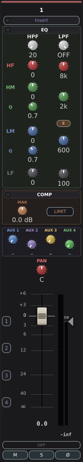

Mixing is the act of balancing your tracks, shaping them with EQ and dynamics, placing them in the stereo field, and gluing the whole thing together on the buses and master.

## A suggested order of operations

1. **Switch to MIXING stage** so the channel strips show send knobs instead of the input block.
2. **Roll the song.** Hit Play and listen all the way through with all faders at unity. Make a mental list of what is too loud, too quiet, too dull, too sharp.
3. **Set rough levels.** Pull faders until the rough balance is right. Do not boost faders above unity if you can avoid it; if a track is too quiet, ask whether the source recording is too quiet first.
4. **Pan.** Place each track in the stereo field. Hard-pan things that occur naturally on one side (drum overheads, double-tracked guitars). Centre things that are foundational (kick, snare, bass, vocal).
5. **HPF every track that doesn't need lows.** Vocals, guitars, and most overdubs need a 60–100 Hz high-pass. Kick and bass don't; everything else probably does.
6. **EQ.** Cut before you boost. If something is muddy, find the muddy frequency and pull it down before you reach for a top-end boost.
7. **Compress.** Use the Opto on smooth sources (vocals, bass), the FET on transients (drums, guitars), the VCA when you need precision.
8. **Bus routing.** Assign drums to bus 1, vocals to bus 2, etc. Tighten the buses with the console-style compressor (2:1 ratio, ~10 ms attack, auto-release, 1–3 dB of reduction).
9. **Aux sends.** Route what needs reverb to aux 1, what needs delay to aux 2.
10. **Master bus.** Glue the whole mix with the master compressor and program EQ. Add a touch of tape if it needs body.
11. **Listen on multiple systems.** Check the **MONO** button on the master strip. Check headphones, laptop speakers, the car. Adjust.

## Aux sends in detail

In the MIXING stage, each channel's four send knobs appear where the input block was in RECORDING. Each knob is colour-matched to its destination aux.

- **Post-fader** (default): pulling the channel fader down also pulls the send level down. Use for effects (reverb, delay) so the wet level stays proportional to the dry.
- **Pre-fader**: the send is independent of the channel fader. Use for cue mixes (you can mute the channel in the main mix while still sending it to the headphone aux).

Right-click a send knob to toggle pre/post.

## Bus routing

Right-click anywhere in the channel strip's fader area for the bus-assign menu. Assigning to a bus **replaces** the channel's direct send to master — the channel reaches master only through the bus once assigned, and the bus's own fader, EQ, and compressor sit in series with the signal. Deassign every bus to send directly to master again. This exclusive routing prevents the same channel arriving at master twice (which would produce a +3 dB doubling).

## Solo and PFL

Dusk Studio's solo is **solo-in-place, additive**:

- Press **S** on any track to solo it. Every other track is muted while any track is soloed.
- Press **S** on a second track to add it to the solo set.
- Press **S** again to remove it.

There is no PFL (pre-fader listen) or AFL (after-fader listen) mode in v1. If you need to audition without the effects of the channel strip, set the **IN** monitor toggle and pull the rest of the mix down.

## Automation

Each channel strip, each bus, and the master strip have an automation mode button below the fader. Cycle through:

- **OFF**: the fader does what you do. No recording, no playback of past rides.
- **READ**: previously recorded automation drives the fader during playback. You can move the fader to "preview" but your changes are not recorded.
- **WRITE**: every fader movement is recorded for as long as the transport rolls. Existing automation in the region played over is overwritten.
- **TOUCH**: while you are touching the fader, your movement is recorded. When you let go, the automation reverts to the previously recorded value via a short ramp.

The same modes apply to pan, mute, and solo. Pan rides like the fader; mute and solo are discrete on/off toggles, so they record only in WRITE (in READ/TOUCH the recorded lane drives them). On a bus the automatable controls are the fader, pan, and mute (bus solo is manual-only).

Dusk Studio's automation is console-first: you ride the controls and the program writes what you did. For touch-up, the audio region editor exposes a per-parameter breakpoint lane - add, drag, and delete points, with linear segments between them. There is no freehand/spline (pencil) curve drawing.

### Editing breakpoints in the region editor

Double-click an audio region to open its editor. The **Auto:** button at the top of the editor picks which parameter the lane edits - **Fader**, **Pan**, **Mute**, **Solo**, or **Aux Send 1-4** - or **Off** to hide the lane and edit the region normally. With a lane active, its points draw over the waveform:

- **Click empty space** - add a breakpoint at the click. It snaps to the grid; hold **Cmd/Ctrl** to place it off-grid.
- **Drag a point** - move it in time and value.
- **Right-click a point** - delete it.

A few rules:

- **Transport must be stopped.** The audio thread reads the lane live during playback, so editing is disabled while rolling.
- **Mute and Solo are on/off lanes** - their points snap to 0 or 1.
- **Drawing a point auto-arms the track to READ** so the lane plays back on the next Play (it won't arm WRITE - your drawn points stay put).
- Segments between points are **linear**; there is no curve/spline shaping.

\newpage

# Plugins

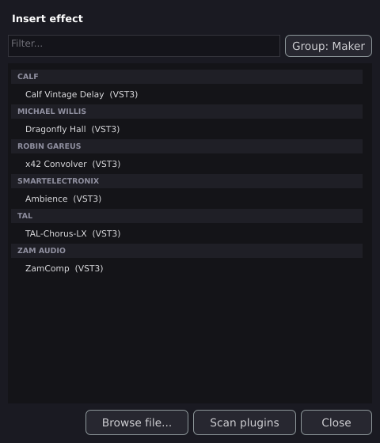

## Plugin formats

Dusk Studio scans and hosts:

- **VST3** on Linux, macOS, and Windows.
- **LV2** on Linux.
- **AU** on macOS only.
- **Native multi-sampler** (`.sfz` and `.sf2` files, both via the built-in sfizz engine — SF2 is converted to SFZ on load) on all platforms.

There is no VST2 support.

## Scanning

Dusk Studio does not automatically scan plugins on first launch. Open any plugin picker (right-click any channel insert slot → **+ Plugin**, or the aux lane plugin slot) and click **Scan plugins**. Scanning takes 10–30 seconds for a large collection.

Plugin scan results are cached in:

- Linux: `~/.config/Dusk Studio/plugin-cache.xml`
- macOS: `~/Library/Application Support/Dusk Studio/plugin-cache.xml`
- Windows: `%APPDATA%\Dusk Studio\plugin-cache.xml`

To re-scan on every launch, enable **Settings → General → Scan plugins on startup**. The startup scan runs in the background behind a progress window (it shows the plugin currently being scanned and a progress bar), so the app stays responsive instead of appearing to hang while a large collection is scanned.

## Loading a plugin

In the **plugin picker** modal:

- Use the filter field at the top to narrow by name.
- The list is grouped by manufacturer. Click a manufacturer to expand or collapse.
- Each row shows the plugin name and its format (VST3 / LV2 / AU).
- Click a row to load and dismiss.

The picker filters by intent: only effect plugins appear when you're loading onto a channel insert or aux lane; only instruments appear when you're loading onto a MIDI track.

At the bottom of the picker are alternative buttons:

- **Hardware insert**: configure the slot as an external hardware insert instead of a plugin.
- **Load Soundfont**: open a file chooser for `.sfz` or `.sf2` files.
- **Browse file…**: load a plugin by file path (useful for plugins not yet in the scan cache).
- **Scan plugins**: re-scan.

## Opening the editor

Click the loaded plugin's slot to open its editor. The editor appears as a centred modal with a dimmed backdrop; press **Esc** or click outside to dismiss. There is no user option to detach it into a floating window.

This holds on all platforms, including the macOS out-of-process sandbox. Rather than reparenting the sandbox child's native window into the main window (cross-process NSView embedding, which Dusk Studio deliberately does not use), macOS hosts the editor **in-process** against a lightweight "shell" instance of the plugin while the plugin's DSP keeps running in the sandbox child; knob moves are mirrored between the shell editor and the running child in both directions. If the plugin cannot be instantiated in-process for editing (its file has moved, or it refuses a second instance), the editor falls back to a floating window owned by the sandbox child — that fallback window is not dimmed by other modals and is closed from its own controls.

## Out-of-process sandboxing

Dusk Studio can run plugins in a child process (the **OOP** sandbox), so that a crashing plugin does not take the whole DAW with it.

OOP is supported on:

- **Linux**: always.
- **Windows**: always.
- **macOS**: requires macOS 14.4 or later. The plugin **editor** is hosted in-process via a shell instance and embeds as a centred modal like the other platforms — see *Opening the editor* above.

OOP is enabled per-session by setting the environment variable `DUSKSTUDIO_USE_OOP_PLUGINS=1` before launching Dusk Studio. A future release will expose this as a per-plugin or per-session UI toggle.

When a plugin crashes in OOP mode:

- The slot auto-bypasses and shows a "Plugin crashed — reload to recover" message.
- The plugin's last-known state (parameters, preset) is preserved in the session and will be re-applied when you reload the plugin.
- You can load a different plugin to clear the slot.

The OOP child process is named `dusk-studio-plugin-host` and lives next to the main Dusk Studio binary. Each loaded OOP plugin runs in its own child process.

## Auto-bypass on overrun

Plugins have a CPU time budget: 60% of the buffer time when in-process, 85% when out-of-process. If a plugin exceeds this for three consecutive blocks, it is automatically bypassed and the slot shows a warning. Right-click the slot and choose **Re-enable plugin** to restore.

## Plugin state in sessions

When you save a session, each loaded plugin's identity (description XML — UID, format, file path) and full state blob (the plugin's `getStateInformation` bytes, base64-encoded) are written to `session.json`.

When you load a session:

- If the plugin is found on the system, it is loaded and the saved state is applied.
- If the plugin is missing or moved, the slot shows "(plugin name) — offline". The saved description and state are preserved; the next session save round-trips them unmodified, so you do not lose the data by opening a session on a machine without that plugin installed. Reinstall the plugin and reload to restore.

## Multi-sample instruments

Drop a `.sfz` or `.sf2` file onto a MIDI track's insert slot to load it through the **sfizz** engine. Most SoundFont and SFZ instrument libraries work directly. The processor exposes three runtime overrides:

- **Master volume**: −60 to +12 dB.
- **Master tune**: −100 to +100 cents.
- **Polyphony cap**: 1 to 256 voices.

The loaded file path is saved with the session.

\newpage

# Hardware inserts

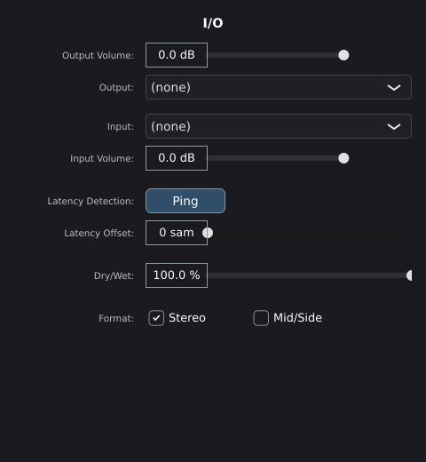

A hardware insert routes a channel or aux's signal out through one of your audio interface's outputs, into an external piece of gear (a compressor, EQ, tape echo, guitar pedalboard, anything), and back in through one of the interface's inputs. The returned signal continues through the channel's chain as if the hardware were a plugin.

## Configuring an insert

Right-click any insert slot (channel or aux) → **Configure as hardware insert**, or click **Hardware insert** in the plugin picker.

The configuration panel has six controls:

- **Output channel**: which audio device output the channel's pre-insert signal is sent to. Choose a stereo pair on a stereo track; a single output on a mono track.
- **Output volume**: a level trim on the send side, 0.0 to 1.0 (linear).
- **Input channel**: which audio device input the returned signal is read from.
- **Input volume**: a level trim on the return side, 0.0 to 1.0.
- **Latency samples**: the round-trip delay through the external gear, in samples. Determines the dry-path delay applied to the rest of the mix so the hardware insert remains time-aligned.
- **Dry/Wet**: 0.0 plays only the dry signal (insert bypassed), 1.0 plays only the returned wet signal. Useful for parallel processing.
- **Format**: **Stereo** or **Mid/Side**. Mid/Side encodes the signal so that the hardware EQ processes the mid and side components independently.

## Auto-measuring latency

Click the **Ping** button. Dusk Studio plays a short chirp through the send, captures the return, and measures the round-trip latency by cross-correlation.

The status label shows one of:

- `Measuring…`
- `Detected: N samples (X.X ms)` — measurement succeeded, the value is filled in.
- `Ping failed — check level / cables` — no correlation peak found.

Run the ping after any change to your interface routing or your external gear's settings. There is no automatic re-ping on session load in v1; you ping when you set up the insert and re-ping if anything in the chain changes.

## Latency compensation

The measured latency is stored per insert and applied as an internal delay line inside the hardware insert slot itself, so that the signal returning from external gear lines up with where it left the channel. Cross-track delay compensation (delaying tracks without inserts by the longest insert latency in the session) is not yet implemented in v1; instrument plugins with reported latency are compensated on their own track only.

\newpage

# Sync to external gear

*(Screenshot pending: the MTC frame-rate dropdown, open, showing all four rates.)*

## MIDI Clock

To slave Dusk Studio to an external master (drum machine, sequencer, or another DAW):

1. Open **Settings → MIDI Sync**.
2. Set **Sync source input** to the MIDI port the master is sending Clock on.
3. Enable **Chase transport (Start/Stop)** if you want Dusk Studio to also follow the master's transport.

Dusk Studio derives its tempo from incoming F8 clock bytes, averaged over the last 24 ticks. Big jumps (>50% drift) are treated as glitches and skipped.

To be the master and emit Clock for downstream gear:

1. Set **Sync output** to the MIDI port the slave is listening on.
2. Enable **Emit clock**.

Dusk Studio emits 24 PPQN MIDI Clock plus FA (Start) and FC (Stop) bytes when the transport rolls.

You can be a master and a slave simultaneously — different ports for input and output. Avoid feedback loops by not looping the same physical port back.

## MIDI Time Code

To slave to SMPTE time code (MTC):

1. Set **Sync source input** to the MTC source.
2. Enable **Chase MTC**.

Dusk Studio decodes quarter-frame messages into SMPTE time, applies a +2 frame compensation for transmission delay, and supports 24, 25, 29.97 drop-frame, and 30 fps frame rates.

To emit MTC:

1. Set **Sync output** to the destination.
2. Enable **Emit MTC**.
3. Pick **MTC frame rate**.

Dusk Studio emits quarter-frame messages while rolling, plus a full-frame sysex on transport edges and large playhead jumps.

## Mackie Control surfaces

To control Dusk Studio from an external surface (tested against the Tascam DP-24SD):

1. Open **Settings → Control surface**.
2. Set **MCU input** to the surface's MIDI output.
3. Set **MCU output** to the surface's MIDI input.

Once connected:

- **Motorised faders** mirror Dusk Studio's channel and master faders.
- The **eight strip faders** drive the active bank (tracks 1–8, 9–16, or 17–24).
- **Bank Left** / **Bank Right** step the bank by 8.
- **Channel Left** / **Channel Right** step the selected channel by 1.
- **Mute / Solo / Arm / Select** buttons mirror and drive the on-screen buttons. LEDs reflect state.
- **V-pot** rotaries drive pan, sends, EQ band gain, or compressor depending on the **assign mode**. Press **Pan**, **Send** (repeated presses cycle sends 1–4), **EQ**, or the **Track** button (mapped to the compressor in Dusk Studio) to switch. The surface's **Plugin** and **Inst** assign buttons are not mapped in v1.
- **Transport buttons** map to Play, Stop, Record, Rewind, Forward, Loop.
- **Jog wheel** scrubs the playhead.
- **Touch sense** drives Touch automation: touching a fader on the surface puts it into touch-write mode while you hold it.

\newpage

# MIDI bindings

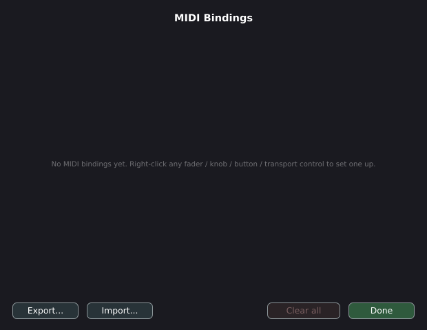

In addition to MCU support, any control in Dusk Studio can be bound to a MIDI CC, note, or pitch-bend from any controller.

## Learning a binding

1. Right-click the control you want to bind (a fader, pan, knob, mute button, etc.).
2. Choose **MIDI Learn**.
3. Move the corresponding control on your MIDI controller.

The binding is captured and immediately active. The next time that CC arrives, the control responds.

## Trigger types

Dusk Studio recognises four kinds of incoming messages:

- **CC** (control change): the data value (0–127) drives a continuous control.
- **Note**: a key press triggers a discrete control (a button).
- **Pitch bend**: 14-bit value (0–16383) drives a continuous control.
- **MMC** (Mackie sysex transport commands): Play, Stop, Record, Locate, etc.

## Button modes

Discrete bindings (mute, solo, arm, transport buttons) can be set to one of two button modes:

- **Press**: triggers on the rising edge only (CC ≥ 64, or note on with velocity ≥ 1). Use for momentary buttons.
- **Toggle**: triggers on every message. Use for latching foot-switches.

Right-click the binding in the MIDI Bindings panel to change its mode.

## Available targets

- **Transport**: Play, Stop, Record, Toggle play/stop.
- **Per-track**: Mute, Solo, Arm.
- **Per-track continuous**: Fader (dB), Pan.
- **Per-track DSP**: HPF frequency, EQ band gain (4 bands), compressor threshold, compressor makeup.
- **Per-track toggles**: EQ on/off, compressor on/off, hardware insert bypass, aux-send pre/post.
- **Per-track plugin parameter**: any indexed parameter on the loaded plugin.
- **Per-bus**: Fader, Pan, Mute, Solo, EQ band gain (LF / MID / HF — 3 bands).
- **Per-aux**: Fader, Mute.
- **Master**: Fader, EQ low boost, EQ high boost, compressor threshold, compressor makeup, compressor ratio.
- **Per-track aux send**: send level for each of the four aux destinations.
- **Bank-relative variants**: every "Per-track ..." target above has a `(banked)` counterpart that drives the active bank's 8 strips by position rather than absolute track number. One 8-fader controller can therefore drive whichever 8 of the 24 tracks are in the visible bank.

## The MIDI Bindings panel

Open from **Settings → MIDI bindings…**.

Each row shows:

- The bound target (e.g., "Track 3 Fader").
- The source (e.g., "CC 7 on Device X, channel 1").
- A **Remove** button.

At the bottom:

- **Export…** writes the entire binding set to a JSON file.
- **Import…** loads a binding set from JSON (replaces the current set).
- **Clear all** removes every binding (with confirmation).

\newpage

# Saving and loading sessions

*(Screenshot pending: the session folder contents on disk, in a file manager.)*

## Where sessions live

A Dusk Studio session is a folder, not a single file. The folder contains:

```
MySession/
├── session.json
└── audio/
    ├── track01_20260526-143025.wav
    └── …
```

`session.json` holds every parameter, region, marker, plugin description, and plugin state in JSON form. `audio/` holds the recorded WAVs and any audio files you imported.

Because the session is a folder, you can copy or back up a session by copying the whole directory. Move it to another machine and the relative paths to the audio files remain valid.

## Save commands

- **File → Save** (or **Cmd+S**): write the current session over the existing `session.json`. The write is atomic — a temporary file is written and fsynced to disk, then renamed over the target. A crash during a save never produces a corrupted file.
- **File → Save As…** (or **Cmd+Shift+S**): pick a new session directory. The audio files are copied to the new directory's `audio/` folder.
- **File → Open…** (or **Cmd+O**): load a session by choosing its folder.
- **File → New from template**: start a fresh session with tracks pre-named and colour-coded for a common workflow. The built-in templates are **Blank** (numbered tracks), **Band** (Drums / Bass / Guitars / Keys / Vocals), **Beats** (Kick / Snare / Hat / Perc / 808 / Pad / Lead / Vox), and **Singer-Songwriter** (Vocal / Acoustic gtr / Bass / Synth / Drums). Templates only set track names and colours — they don't add plugins or audio.

## Autosave

Every 30 seconds, if anything has changed since the last save, Dusk Studio writes a recovery file, `session.json.autosave`, next to the canonical `session.json` (it does **not** overwrite `session.json` — a manual Save is still what updates the real session file). The autosave is atomic (same temp-file-and-rename pattern) and silent — it never interrupts playback or recording. Idle sessions are skipped via a content hash, so the file isn't rewritten when nothing meaningful changed.

If Dusk Studio crashes or loses power, the next launch detects the autosave file and offers to recover. A manual Save deletes the autosave, so a leftover autosave that differs from `session.json` is the signal that a recovery point exists.

Plugin and tape state are captured in the autosave along with everything else, so recovery restores your processing as it stood at the last tick.

## What's in a session

A session captures everything user-visible:

- Tracks: names, colours, modes, armed state, input sources, channel strip parameters.
- Regions: file paths, timeline positions, lengths, source offsets, fades, gains, labels, colours, locks, mutes, take history.
- Mixer: aux lane names and contents, bus parameters, master parameters.
- Plugins: descriptions and state blobs for every loaded plugin.
- Transport: loop and punch points, BPM, time signature. (The playhead position itself is not persisted; sessions reopen at bar 1.)
- Markers: positions, names, colours.
- MIDI bindings.
- MIDI sync source/output, MCU port identifiers.
- The currently loaded mastering source file (if any).

## Backing up

Because sessions are self-contained folders, backup is just a copy:

```
cp -r MySession ~/Backups/MySession-20260526
```

For larger archives, `tar czf` the folder and store the tarball.

\newpage

# Bouncing and exporting


## Bouncing the mix

To export your finished mix as a stereo audio file:

1. From any stage, choose **File → Bounce…** (or **Cmd/Ctrl+B**).
2. A file browser opens at the session folder; pick or rename the destination WAV and confirm.
3. A progress dialog renders the project offline. **Cancel** stops the render.

The output is always **stereo 24-bit WAV at the current device sample rate**, with a fixed 5-second tail so reverb and compression ringouts decay naturally. Dusk Studio offers no per-bounce format options in v1.

Dusk Studio detaches from the realtime audio device and renders the project offline as fast as the CPU allows. When the bounce completes, the audio device is automatically re-attached.

The File menu has three bounce commands:

- **Bounce…** — render the full master mix to a WAV you choose.
- **Mixdown** — one-shot render to `mixdown.wav` in the session folder, then automatically switch to the MASTERING stage with that file loaded.
- **Bounce stems…** — render one WAV per track (named `<base>_<NN>_<track>.wav`); warns before overwriting any existing stem files.

## Bouncing the master vs the mastering chain

- **Bounce master mix**: captures the post-master-fader stereo output of the live mix (channels → buses → master → output).
- **Bounce mastering chain**: from the MASTERING stage, **Export master…** captures the post-limiter output of the mastering chain on the loaded source file.

## Where bounces go

By default, bounces are written to the session folder itself (the same directory that holds `session.json`). The bounce dialog opens a file browser there so you can rename or redirect each export. The most-recent bounce in the session folder is what the mastering stage's **Load latest mixdown** button picks up.

\newpage

# Keyboard reference

Shortcuts use **Cmd** on macOS and **Ctrl** on Linux and Windows unless noted.

## File

| Shortcut        | Action               |
| --------------- | -------------------- |
| **Cmd+N**       | New session…         |
| **Cmd+O**       | Open session…        |
| **Cmd+S**       | Save session         |
| **Cmd+Shift+S** | Save As…             |
| **Cmd+I**       | Import audio / MIDI… |
| **Cmd+B**       | Bounce…              |
| **Cmd+Q**       | Quit                 |

## Edit

| Shortcut                    | Action                                 |
| --------------------------- | -------------------------------------- |
| **Cmd+Z**                   | Undo                                   |
| **Cmd+Shift+Z** / **Cmd+Y** | Redo                                   |
| **Cmd+C**                   | Copy selected region                   |
| **Cmd+X**                   | Cut selected region                    |
| **Cmd+V**                   | Paste at playhead                      |
| **Cmd+D**                   | Duplicate selected region              |
| **Delete** / **Backspace**  | Delete selected region                 |
| **T**                       | Split selected region at playhead      |
| **Cmd+←**                   | Nudge selected region one beat earlier |
| **Cmd+→**                   | Nudge selected region one beat later   |
| **Cmd+Shift+←**             | Nudge by one bar (earlier)             |
| **Cmd+Shift+→**             | Nudge by one bar (later)               |
| **Alt+T**                   | Cycle to next take on selected region  |
| **Alt+Shift+T**             | Cycle to previous take                 |

## Transport

| Shortcut    | Action                        |
| ----------- | ----------------------------- |
| **Space**   | Play / Stop                   |
| **R**       | Record (requires armed track) |
| **Home**    | Seek to start                 |
| **.**       | Stop and seek to start        |
| **L**       | Toggle loop                   |
| **P**       | Toggle punch                  |
| **C**       | Toggle metronome              |
| **M**       | Drop marker at playhead       |
| **[**       | Set loop start at playhead    |
| **]**       | Set loop end at playhead      |
| **Shift+[** | Set punch in at playhead      |
| **Shift+]** | Set punch out at playhead     |
| **K**       | Toggle virtual MIDI keyboard  |

## Tracks

| Shortcut | Action                        |
| -------- | ----------------------------- |
| **A**    | Toggle ARM on selected track  |
| **S**    | Toggle SOLO on selected track |
| **X**    | Toggle MUTE on selected track |

## Timeline

| Shortcut              | Action             |
| --------------------- | ------------------ |
| **=** / **+**         | Zoom in            |
| **−**                 | Zoom out           |
| **0**                 | Zoom fit           |
| **Cmd+wheel**         | Zoom around cursor |
| **Shift+wheel**       | Horizontal scroll  |
| **Middle-mouse drag** | Pan                |

## Region editor

| Shortcut              | Action                                             |
| --------------------- | -------------------------------------------------- |
| **S** / **Cmd+E**     | Split at edit cursor                               |
| **G**                 | Cycle edit mode (Grab / Range / Cut / Grid / Draw) |
| **Cmd+]** / **Cmd+[** | Next / previous region                             |
| **Esc**               | Close modal                                        |

## Piano roll

The piano roll modal captures its own keypresses first (see `PianoRollComponent::keyPressed`); the table below is the full set.

| Shortcut                          | Action                                                       |
| --------------------------------- | ------------------------------------------------------------ |
| **↑** / **↓**                     | Transpose selected notes ±1 semitone                         |
| **←** / **→**                     | Nudge selected notes ±1 grid step                            |
| **Q**                             | Quantize popup                                               |
| **S**                             | Scale picker popup                                           |
| **V**                             | Velocity popup (set / humanise)                              |
| **G**                             | Glue selected same-pitch contiguous notes                    |
| **L**                             | Cycle active CC controller in CC lane (1 / 7 / 11 / 64 / 74) |
| **C**                             | Cycle colour mode (Pitch / Velocity / Channel)               |
| **Cmd+A**                         | Select all notes in region                                   |
| **Cmd+C** / **Cmd+X** / **Cmd+V** | Copy / cut / paste selected notes                            |
| **Cmd+D**                         | Duplicate selected notes                                     |
| **Cmd+Z**                         | Undo last note edit                                          |
| **Cmd+←** / **Cmd+→**             | Pan the view horizontally                                    |
| **Home** / **End**                | Jump view to region start / end                              |
| **Cmd+]** / **Cmd+[**             | Next / previous MIDI region                                  |
| **Esc**                           | Close modal                                                  |

## Window

| Shortcut       | Action                          |
| -------------- | ------------------------------- |
| **F11**        | Toggle fullscreen               |
| **Cmd+\\**     | Show / hide the tape strip (TIMELINE) |
| **Esc**        | Close current modal             |

## Notes on shortcut design

- Shortcuts that would conflict with a focused text field always defer to the text field. You can edit a track label or type into the BPM spinner without accidentally arming a track or starting playback.
- **M** drops a marker at the playhead, not mute; per-track mute is **X** to avoid the clash with the marker action.
- Plain **B** is unused; **Cmd+B** triggers Bounce (Logic convention).

\newpage

# Tips and recipes

## A clean vocal chain

1. **HPF** at 80–100 Hz to remove low-frequency rumble.
2. **EQ**: a 2–4 dB cut at the muddy frequency (usually 200–400 Hz) and a 1–2 dB shelf boost above 8 kHz for air.
3. **Compressor → Opto** with 40% peak reduction and 50% gain. Should pull 3–5 dB on peaks.
4. **Aux 1** send (post-fader) at −12 dB to a reverb on the aux lane.
5. **Aux 2** send (post-fader) at −18 dB to a delay on the aux lane.

## Glued drums on a bus

1. Route every drum channel to **Bus 1** (right-click → bus assigns).
2. On Bus 1, enable the bus compressor: **4:1 ratio**, **10 ms attack**, **auto-release on**. Set the threshold to pull 2–3 dB on the loudest hits.
3. Boost the bus EQ's **HF** band 1–2 dB at 8 kHz to bring out the cymbals.

## Mastering for streaming

1. Switch to the **MASTERING** stage and **Load latest mixdown**.
2. Enable all three stages: **EQ**, **Comp**, **Limiter**.
3. On the EQ, a 1–2 dB shelf boost at 10 kHz and a 0.5–1 dB cut at 250 Hz is a safe starting point.
4. On the bus comp, aim for 0.5–1 dB of reduction on peaks. Slow attack (30 ms), slow release (250 ms), 2:1.
5. On the limiter, leave the ceiling at **−1.0 dB** for Spotify, **−1.0 dB** for Apple Music, **−1.0 dB** for YouTube. Push the **Drive** until the integrated LUFS reads −14 (Spotify and YouTube) or −16 (Apple Music) — but stop pushing as soon as the limiter is regularly pulling more than 2 dB.
6. Use the **streaming-platform preset** picker to colour-code the readouts and confirm you're within target.

## Headphone cue mix for tracking

> **Planned - not yet implemented.** Per-aux physical outputs (a discrete cue / monitor send) are on the roadmap but not in this build: today all four aux returns sum into the master and leave through the single device output. The recipe below describes the intended workflow.

1. Send each tracking channel pre-fader to **Aux 4**.
2. Route the aux 4 output to a separate physical output (the headphone amp).
3. Adjust each channel's aux 4 send to balance what the performer hears, independently of what you hear on the main mix.

## Parallel compression on drums

1. Send the drum bus to **Aux 1** at unity, pre-fader.
2. On Aux 1, load a heavy FET-style compressor (or use a plugin) with the ratio at **All buttons in** and a fast attack.
3. Bring the Aux 1 return up underneath the drum bus until the drums punch.

## Splicing a vocal comp from multiple takes

1. Record three or four passes into the same region, each fully containing the last. Each pass pushes the previous one into the take history.
2. In the audio region editor, cycle through takes (**Alt+T** / **Alt+Shift+T**) and listen to each.
3. Pick the best phrases by splitting (**S** or **T**) at the breaths, choosing the best take per phrase, and using fades to mask the joins.

\newpage

# Troubleshooting


## "Plugin crashed — reload to recover"

A plugin running in the OOP sandbox has exited. The slot is auto-bypassed and the plugin's state is preserved.

- Right-click the slot and choose **Reload** to relaunch the plugin with its saved state.
- If the plugin keeps crashing on a specific session, try loading it without OOP (launch Dusk Studio without `DUSKSTUDIO_USE_OOP_PLUGINS=1`) to see if the in-process path is more stable.
- Some plugins are not RT-safe and may misbehave; replace with a different plugin if reloading does not help.

## "(plugin name) — offline"

The session references a plugin Dusk Studio cannot find on this machine.

- The saved state is preserved — the next session save will round-trip it intact.
- Install the missing plugin (or run a fresh plugin scan if it is already installed) and reload the session. The slot will populate.

## Auto-bypass

A plugin is using more than 60% (or 85% in OOP mode) of the audio buffer time for three blocks in a row, and has been bypassed for safety.

- Right-click the slot and choose **Re-enable plugin**.
- If it auto-bypasses again, the plugin is too expensive for the current buffer size. Raise the buffer size in **Settings → Audio**, or use a less expensive plugin.

## Pops, clicks, or glitches

- Raise the audio device's block size in **Settings → Audio**.
- On Linux, raise the ALSA period count from 2 to 3.
- Reduce the effect oversampling to 1× in **Settings → Advanced**.
- Check that no track is clipping (red bar at the top of the input meter).
- Close other CPU-heavy programs.

## "Ping failed — check level / cables"

The hardware-insert latency ping could not find a correlation peak.

- Confirm the output cable is going to the external gear's input, and the gear's output is going to the input cable.
- Raise the output volume on the hardware insert.
- Raise the input gain on your audio interface.
- Confirm the external gear is powered and not in bypass.

## Session won't open

- Check that the session folder contains both `session.json` and an `audio/` subfolder.
- If `session.json` is missing but an autosave file exists (look for `session.autosave.json` in the same folder), rename it to `session.json` and try again.
- Open `session.json` in a text editor to confirm it parses as JSON — a power loss during a non-atomic save on an old filesystem could in theory corrupt it. The atomic-write strategy makes this extremely unlikely.

## Missing audio files

- If you moved or renamed individual files in the `audio/` folder, the regions that reference them will be silent. Restore the file names.
- If you moved the session folder to another machine, the relative paths inside `session.json` should still resolve because every reference is relative to the session folder.

## Audio device disconnected mid-session

If your audio interface goes away while Dusk Studio is running — USB cable yanked, OS audio service restart, exclusive-mode plugin from another app stealing the device — the engine detects the loss within a couple of message-loop ticks and:

- Stops the transport (any in-flight recording is committed safely; no take is lost).
- Surfaces a banner: *"The active audio device has disconnected. Open Audio Settings to select a new device."*
- Leaves your session untouched on disk and in memory.

Reconnect the interface (or pick a different device in **Settings → Audio**), and the engine re-prepares every channel strip and aux at the new sample rate / block size automatically. No restart required.

If the disconnect happened during a take, the WAV that was being written is committed up to the last full audio block. The region is added to your timeline at the take start position — same as if you'd pressed Stop manually. The session save / autosave path is independent of the audio device.

# Accessibility

Dusk Studio targets functional accessibility for screen reader users. The 24-channel strip is dense; the goal is for a screen reader to identify each control's role and read its current value without the user having to guess.

## What works today

- Every channel-strip rotary (HPF, LPF, EQ band gain / freq / Q, compressor knobs, pan, fader, aux sends) has an accessibility title and reports its formatted value: `-4.2 dB`, `L42`, `OFF`, `4:1`, etc. VoiceOver on macOS and Orca on Linux speak both the role and the value on focus.
- Bus strips, aux returns, and the master strip follow the same convention.
- Help text (the long-form description for each control) is wired from the existing tooltip strings, so the screen reader's verbose-mode readout matches what a sighted user sees on hover.
- Every text-input dialog (region rename, marker rename, MIDI region label) renders inside the main window via the EmbeddedModal framework — no native popups that escape the screen reader's focus tree.

## What's still rough

- Keyboard-only navigation of the 24-channel mixer is not yet fully smooth. Tab order across all 24 strips works but is verbose. A planned 1.x release adds bank-relative keyboard shortcuts (Cmd-1 through Cmd-8 focus the current bank's 8 strips directly).
- Region drag-and-drop on the timeline relies on mouse gestures. Region edit actions (split, trim, fade, gain) are all available via the keyboard reference; the drag-to-move case is the gap.
- Plugin editors are out of Dusk Studio's accessibility control surface. JUCE forwards screen-reader requests to each plugin; vendor accessibility varies.

## Filing issues

If a control has the wrong title, an unreadable value, or doesn't surface to your screen reader at all, please [file an issue on GitHub](https://github.com/dusk-audio/dusk-studio/issues) with your OS + screen reader version. Accessibility regressions are treated as bugs, not feature requests.

\newpage

# Messages

A dictionary of every alert, confirmation, and inline status banner Dusk Studio can show. Use this chapter as a reference when a dialog you don't recognise appears, or when you want to know exactly what each button does.

The format for each entry:

- **Title** — the dialog's title bar text.
- **When** — what action or condition triggers it.
- **Text** — the verbatim message body. Bracketed `[fields]` are filled in at runtime.
- **Buttons** — the user options. The leftmost button is the default for Esc / click-outside.
- **Action** — what to do next.

## Recording

### Recording setup failed

- **When**: One or more armed tracks couldn't start recording (disk full, write permission missing, corrupted audio folder).
- **Text**: "These armed tracks could not start recording: Tracks [list]. Common causes: disk full, missing write permission on the session's audio folder, or a corrupted audio directory. The other armed tracks are recording normally; the listed tracks are NOT capturing audio. Stop the transport and check the session folder before continuing."
- **Buttons**: OK.
- **Action**: Stop playback. Free disk space, fix permissions, or repair the audio folder, then re-arm.

### Recording errors

- **When**: A take finishes, but at least one track had a write error or MIDI overflow mid-take.
- **Text**: "The last take captured with errors. Listed tracks may be partial or missing audio / MIDI data: [per-track byte/event counts]. Check the session's audio folder for free space and the session log for I/O details before continuing."
- **Buttons**: OK.
- **Action**: Check disk space and the session log. The partial take is preserved in take history; you can roll back to a previous take and re-record the bad ones.

## Session

### Recover from autosave?

- **When**: App startup finds an autosave file newer than `session.json`, meaning Dusk Studio probably crashed.
- **Text**: "An autosave file is newer than the saved session at [path]. Autosave: [time]. Saved: [time]. Dusk Studio probably exited unexpectedly. Recover the newer autosave, or load the saved session and discard it?"
- **Buttons**: **Recover autosave** / **Load saved session** / **Cancel**.
- **Action**: Recover unless you remember explicitly discarding work since the last save.

### Save changes before quitting?

- **When**: You quit with unsaved changes.
- **Text**: "Your session has unsaved changes since the last manual save. If you don't save, the autosave will still be available the next time you open this session."
- **Buttons**: **Save** / **Don't Save** / **Cancel**.
- **Action**: Save unless you specifically want to discard. The autosave file remains as a safety net regardless.

### Save failed

- **When**: `session.json` couldn't be written (disk full, permission denied, folder moved out from under the app).
- **Text**: "Dusk Studio could not write the session file: [path]. Common causes: disk full, missing write permission, or the parent folder was moved since the session was opened. The session is unchanged in memory; try Save As to a different location."
- **Buttons**: OK.
- **Action**: Use **Save As…** to land the session somewhere writable. Do not quit before saving — your in-memory state is intact.

### Clean out

Three variants:

- **No audio directory**: "This session has no audio directory yet, so there's nothing to clean." — Buttons: OK.
- **No unreferenced files**: "No unreferenced files found. The audio directory is already clean." — Buttons: OK.
- **Confirm delete**: "Found [N] unreferenced .wav file(s) totalling [size] MB. These were created by past record passes that no longer have any region or take pointing at them. Deleting cannot be undone." — Buttons: **Delete** (destructive, red) / **Cancel**.
- **Action**: Confirm only if you have backed up anything you might still want.

### Optimize automation

Two variants:

- **Automation active**: "Stop playback before optimising automation. The optimiser rewrites every lane's point data; running it while the audio thread may be reading the lanes is unsafe." (Or the equivalent "Set every strip's automation mode to Off before optimising. …" when the transport is stopped but lanes are still in Read/Touch.) — Buttons: OK.
- **Success**: "Thinned [before] automation points down to [after]." — Buttons: OK.
- **Action**: Stop playback and set all strips to **Off** mode, then retry.

### Missing plugins

- **When**: Session load found plugin references that can't be instantiated on this machine.
- **Text**: "These plugins from the saved session could not be loaded and were left empty: [per-plugin: location — plugin name]. Check that the plugins are still installed for the right format (VST3 / LV2 / AU) and that this binary can find them, then reload the session."
- **Buttons**: OK.
- **Action**: Install the missing plugins (or the right plugin format) and reload the session. Saved state for offline plugins is preserved on disk; it round-trips through the next save.

### About Dusk Studio

- **When**: Help → About.
- **Text**: "Dusk Studio [version]. Portastudio-style DAW. Built [date] [time]."
- **Buttons**: OK (or click outside / Esc).

## Import / Export

### Import

- **Stop playback**: "Stop playback before importing files." — Buttons: OK.
- **Unsupported format**: "Unsupported or unreadable audio file: [filename]" — Buttons: OK.
- **Decode failure**: "[error message from file decoder]" — Buttons: OK.
- **MIDI unreadable**: "Could not read MIDI file." — Buttons: OK.
- **MIDI batch failure**: "[error message from MIDI importer]" — Buttons: OK.

### Switch track to [mode]?

- **When**: You drop a file whose channel layout or MIDI/audio status differs from the destination track's current mode.
- **Text**: "Track [N] is currently in [current mode] mode. Importing this [file type] file will switch the track to [target mode] mode. Proceed?"
- **Buttons**: **Switch** / **Cancel**.
- **Action**: Confirm if you intended a mode change; otherwise cancel and pick a different destination.

### MIDI bindings export / import failed

- **Export**: "Could not write to [path]" — disk full or permission denied.
- **Import**: "Could not read bindings from [path]. File is missing or malformed." — bad JSON or missing file.
- **Buttons**: OK.

## Plugins

### Plugin kind mismatch

- **When**: You try to drop an instrument plugin onto an effect slot or vice versa.
- **Text**: "This slot expects an [instrument/effect] plugin but the chosen file is an [effect/instrument]. The slot was left empty. Use a MIDI track for instrument plugins and an audio track for effect plugins."
- **Buttons**: OK.

### Plugin load failed

- **When**: The picked plugin file failed to instantiate or parse.
- **Text**: "[plugin-supplied error message, or 'Unknown error']"
- **Buttons**: OK.
- **Action**: Reinstall the plugin or pick a different one. Check the session log for the underlying error.

### Plugin scan complete

- **When**: The scanner finishes (startup-auto or manual).
- **Text**: title "Plugin scan complete", body "1 new plugin added." (singular) or "N new plugins added." (plural).
- **Buttons**: none — the dialog holds briefly, then closes itself.

### Plugin slot labels (inline, not a dialog)

- `⚠ <name> (crashed)` — the plugin has crashed. Right-click → **Re-enable plugin (crashed)** to retry.
- `<name> (stalled)` — the plugin exceeded its CPU budget for several consecutive blocks and was auto-bypassed. Right-click → **Re-enable plugin (auto-bypassed)** to retry.

## Hardware insert

The hardware-insert ping reports its result inline on the editor (not a modal), colour-coded:

- **No input signal** (red): "No input signal - check routing / device." — capture stall, no audio came back at all.
- **Ping failed** (red): "Ping failed - check level / cables." — audio came back but cross-correlation found no clear peak.
- **Success** (green): "Detected: [N] sam ([X.X] ms)" — measurement succeeded; latency is filled in.

## Tempo

### Confirm tempo change

- **When**: You change BPM while the session contains tempo-locked MIDI regions, floating MIDI regions, or automation points.
- **Text**: "Change tempo from [old] to [new] BPM? [impact summary]. Audio regions and markers are NOT retimed."
- **Buttons**: **Apply** / **Cancel**.
- **Action**: Confirm only after reviewing what will be retimed. Audio regions stay put at their sample positions, so a tempo change can break time alignment between audio and MIDI; redo the audio takes if necessary.

## Startup

### Empty recents

- **When**: First launch or after the recents list has been cleared.
- **Text**: "No recent sessions yet." (inline label in the Startup dialog, not a modal).
- **Action**: Choose **New** or **Open** from the same dialog.

\newpage

# Appendix A — Parameter ranges and defaults

## Channel strip

| Block    | Param          | Range                         | Default  |
| -------- | -------------- | ----------------------------- | -------- |
| Phase    | Invert         | Off / On                      | Off      |
| Insert   | Mode           | Empty / Plugin / Hardware     | Plugin   |
| HPF      | Enable         | Off / On                      | Off      |
| HPF      | Frequency      | 20–300 Hz                     | 20 Hz    |
| LPF      | Enable         | Off / On                      | Off      |
| LPF      | Frequency      | 3–20 kHz                      | 20 kHz   |
| EQ       | Enable         | Off / On                      | Off      |
| EQ       | Mode           | E (brown) / G (black)         | E        |
| EQ LF    | Frequency      | 20–400 Hz                     | 100 Hz   |
| EQ LF    | Gain           | ±15 dB                        | 0 dB     |
| EQ LM    | Frequency      | 100 Hz–4 kHz                  | 600 Hz   |
| EQ LM    | Gain           | ±15 dB                        | 0 dB     |
| EQ LM    | Q              | 0.4–4.0                       | 0.7      |
| EQ HM    | Frequency      | 600 Hz–13 kHz                 | 2 kHz    |
| EQ HM    | Gain           | ±15 dB                        | 0 dB     |
| EQ HM    | Q              | 0.4–4.0                       | 0.7      |
| EQ HF    | Frequency      | 1–20 kHz                      | 8 kHz    |
| EQ HF    | Gain           | ±15 dB                        | 0 dB     |
| Comp     | Enable         | Off / On                      | Off      |
| Comp     | Mode           | Opto / FET / VCA              | Opto     |
| Opto     | Threshold (Peak red.) | set on GR meter         | —        |
| FET      | Threshold      | −60 to 0 dB                   | −10 dB   |
| FET      | Ratio          | 4:1 / 8:1 / 12:1 / 20:1 / All | 4:1      |
| FET      | Attack         | 0.02–80 ms                    | 0.2 ms   |
| FET      | Release        | 50–1100 ms                    | 400 ms   |
| VCA      | Threshold      | −38 to +12 dB                 | +12 dB   |
| VCA      | Ratio          | 1:1–120:1                     | 4:1      |
| VCA      | Attack         | 0.1–50 ms                     | 1 ms     |
| VCA      | Release        | 10–5000 ms                    | 100 ms   |
| VCA      | Soft knee      | Off / On                      | Off      |
| VCA      | Detector       | Adaptive / Classic            | Adaptive |
| Comp     | Makeup         | −12 to +24 dB                 | 0 dB     |
| Send 1–4 | Level          | −60 to +6 dB (or OFF)         | OFF      |
| Send 1–4 | Pre/Post       | Pre / Post                    | Post     |
| Pan      | Position       | −1.0 to +1.0                  | 0        |
| Fader    | Level          | −∞ to +12 dB                  | 0 dB     |
| Mute     | On/Off         | Off / On                      | Off      |
| Solo     | On/Off         | Off / On                      | Off      |
| Bus 1–4  | Assign         | Off / On                      | Off      |

## Bus strip

| Block  | Param        | Range         | Default |
| ------ | ------------ | ------------- | ------- |
| EQ     | Enable       | Off / On      | Off     |
| EQ LF  | Gain         | ±9 dB         | 0 dB    |
| EQ MID | Gain         | ±9 dB         | 0 dB    |
| EQ HF  | Gain         | ±9 dB         | 0 dB    |
| Comp   | Enable       | Off / On      | Off     |
| Comp   | Threshold    | −30 to +15 dB | 0 dB    |
| Comp   | Ratio        | 1:1–10:1      | 4:1     |
| Comp   | Attack       | 0.1–50 ms     | 10 ms   |
| Comp   | Release      | 50–1000 ms    | 100 ms  |
| Comp   | Auto release | Off / On      | On      |
| Comp   | Makeup       | −10 to +20 dB | 0 dB    |
| Pan    | Position     | −1.0 to +1.0  | 0       |
| Fader  | Level        | −∞ to +12 dB  | 0 dB    |
| Mute   | On/Off       | Off / On      | Off     |
| Solo   | On/Off       | Off / On      | Off     |

## Aux return lane

| Block        | Param  | Range                     | Default |
| ------------ | ------ | ------------------------- | ------- |
| Insert       | Mode   | Empty / Plugin / Hardware | Plugin  |
| Return fader | Level  | −∞ to +12 dB              | 0 dB    |
| Mute         | On/Off | Off / On                  | Off     |

## Master bus

| Block        | Param         | Range                      | Default |
| ------------ | ------------- | -------------------------- | ------- |
| Tape         | Enable        | Off / On                   | Off     |
| Program EQ   | Enable        | Off / On                   | Off     |
| Program EQ   | LF Boost      | 0–10                       | 0       |
| Program EQ   | LF Atten      | 0–10                       | 0       |
| Program EQ   | LF Freq       | 20 / 30 / 60 / 100 Hz      | 60 Hz   |
| Program EQ   | HF Boost      | 0–10                       | 0       |
| Program EQ   | HF Freq       | 3, 4, 5, 8, 10, 12, 16 kHz | 8 kHz   |
| Program EQ   | HF Bandwidth  | 0–10                       | 0.5     |
| Program EQ   | HF Atten      | 0–10                       | 0       |
| Program EQ   | HF Atten Freq | 5, 10, 20 kHz              | 10 kHz  |
| Comp         | Enable        | Off / On                   | Off     |
| Comp         | Threshold     | −30 to +15 dB              | 0 dB    |
| Comp         | Ratio         | 1:1–10:1                   | 4:1     |
| Comp         | Attack        | 0.1–50 ms                  | 10 ms   |
| Comp         | Release       | 50–1000 ms                 | 100 ms  |
| Comp         | Auto release  | Off / On                   | On      |
| Comp         | Makeup        | −10 to +20 dB              | 0 dB    |
| Master fader | Level         | −∞ to +12 dB               | 0 dB    |
| Mono         | Off / On      | Off / On                   | Off     |

## Mastering chain

| Block     | Param                            | Range         | Default     |
| --------- | -------------------------------- | ------------- | ----------- |
| EQ        | Enable                           | Off / On      | Off         |
| EQ band 0 | Low shelf, 80 Hz, ±12 dB         |               | 0 dB        |
| EQ band 1 | Peaking, 250 Hz, ±12 dB, Q 0.4–4 |               | 0 dB, Q 1.0 |
| EQ band 2 | Peaking, 1 kHz, ±12 dB, Q 0.4–4  |               | 0 dB, Q 1.0 |
| EQ band 3 | Peaking, 4 kHz, ±12 dB, Q 0.4–4  |               | 0 dB, Q 1.0 |
| EQ band 4 | High shelf, 12 kHz, ±12 dB       |               | 0 dB        |
| Comp      | Enable                           | Off / On      | Off         |
| Comp      | Threshold                        | −30 to +15 dB | 0 dB        |
| Comp      | Ratio                            | 1:1–10:1      | 2:1         |
| Comp      | Attack                           | 0.1–50 ms     | 30 ms       |
| Comp      | Release                          | 50–1000 ms    | 250 ms      |
| Comp      | Auto release                     | Off / On      | On          |
| Comp      | Makeup                           | −10 to +20 dB | 0 dB        |
| Limiter   | Enable                           | Off / On      | On          |
| Limiter   | Ceiling                          | −12 to 0 dB   | −0.3 dB     |
| Limiter   | Drive                            | 0 to +20 dB   | 0 dB        |
| Limiter   | Release                          | 50–300 ms     | 100 ms      |

\newpage

# Appendix B — File formats

| Artifact             | Format                                                 |
| -------------------- | ------------------------------------------------------ |
| Session              | JSON, atomic write                                     |
| Recorded audio       | 24-bit PCM WAV, session sample rate                    |
| Imported audio       | re-encoded to 24-bit WAV in session/audio/             |
| Recorded MIDI        | embedded in session.json (note + CC arrays per region) |
| Plugin scan cache    | XML, per-user config directory                         |
| MIDI bindings export | JSON                                                   |
| Bounce               | 24-bit PCM WAV, session sample rate                    |

\newpage

# Appendix C — Glossary

**Aux lane.** A return path that receives sends from any number of channels, processes them through one plugin or hardware insert, and feeds the result into the master. Four aux lanes total.

**Bank.** A group of 8 channels mapped to a Mackie Control surface's eight strips. Three banks cover the full 24 channels.

**Bounce.** Offline rendering of the project to a stereo audio file.

**Brickwall limiter.** A compressor with infinite ratio and a hard ceiling, used as the final stage of mastering to prevent inter-sample peaks.

**Bus.** A summing point for multiple channels. Dusk Studio has four buses.

**Count-in.** A configurable number of clicks before recording starts.

**FET compressor.** A solid-state compressor in the classic fast-FET tradition, with very fast attack and a discrete ratio selector.

**LUFS.** Loudness Units, Full Scale. A perceptual loudness measurement defined by ITU BS.1770.

**Mackie Control (MCU).** A protocol for control surfaces with motorised faders and bank-of-eight ergonomics.

**Mastering chain.** A separate signal flow that processes a finished mix file through dedicated EQ, compression, and limiting.

**OOP plugin sandbox.** Out-of-process plugin hosting. Each loaded plugin runs in a child process so a crash does not take the DAW with it.

**Opto compressor.** A compressor whose gain reduction is performed by a photo-resistor, in the classic optical tradition.

**Program EQ.** A passive program-EQ topology with separately controllable boost and cut at the same frequency.

**Punch in / punch out.** Pre-set in and out positions that constrain recording to a specific window.

**Region.** A piece of audio or MIDI placed on the timeline at a specific position.

**SIP (solo-in-place).** A solo mode in which un-soloed tracks are silenced from the main mix output (as opposed to PFL, which only affects monitoring).

**Take.** A single recording pass. Dusk Studio keeps up to 20 previous takes per region.

**Tape strip.** Dusk Studio's timeline canvas.

**VCA compressor.** A compressor with a Voltage-Controlled Amplifier as the gain element. Clean, fast, with wide attack/release ranges and adjustable knee.

---

*Dusk Studio — a portastudio for the desktop.*
