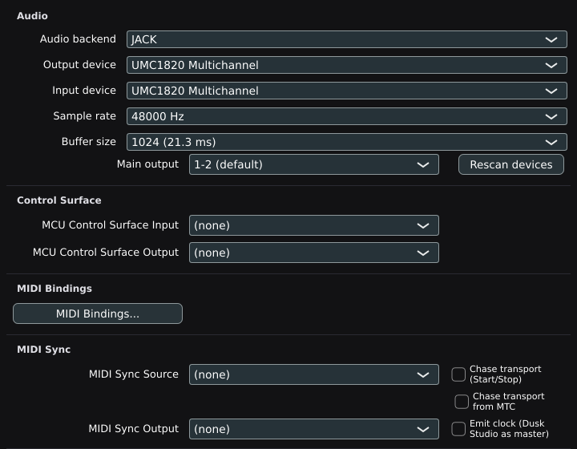
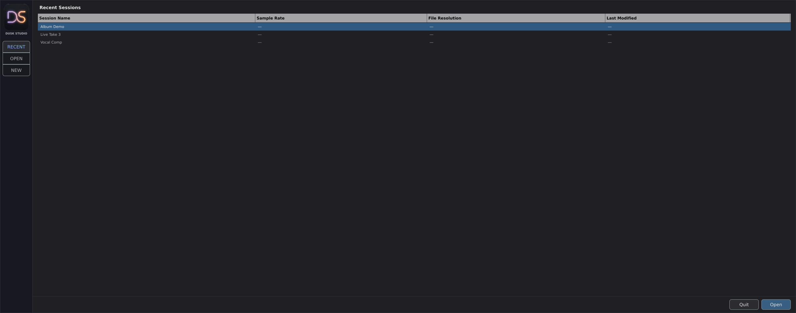
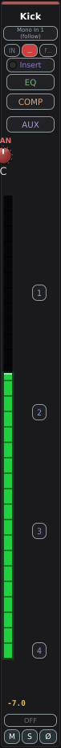
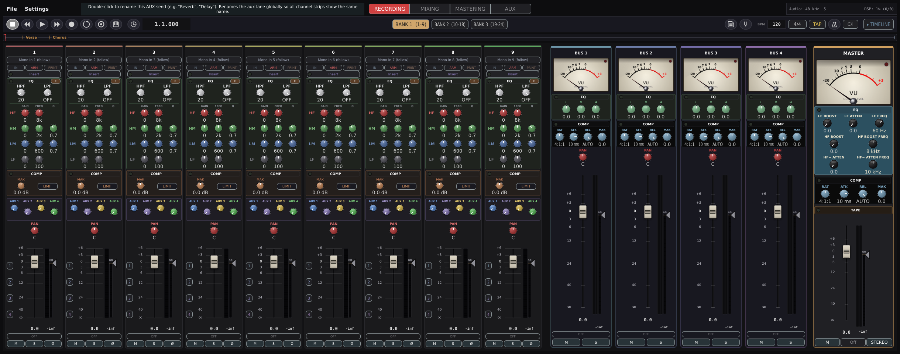
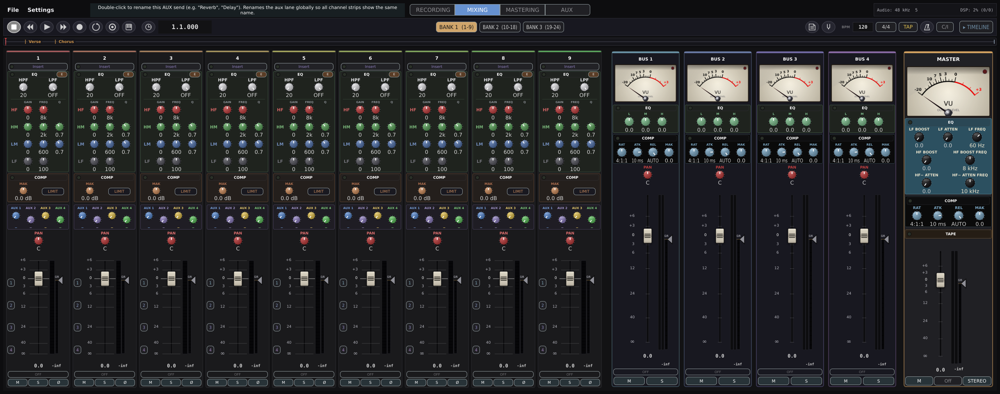
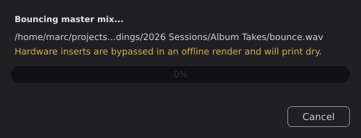

# Dusk Studio quickstart

Five minutes from a downloaded file to a mixed-down track. If you want the
detail on any of this, it is all in [MANUAL.md](MANUAL.md).

## 1. Install and open it

The builds are not signed yet, so each system asks about that once. This is
expected and it goes away when signed builds land.

**Linux.** Unpack the tarball and run it in place:

    tar -xf dusk-studio-*-Linux-x86_64.tar.xz
    cd dusk-studio-*-Linux-x86_64
    ./DuskStudio/DuskStudio

Run `./install.sh` if you also want it in your application menu and on your
PATH. It installs under `~/.local` and needs no root.

**macOS.** Open the DMG and drag Dusk Studio to Applications. The first time you
open it, right-click the app and choose Open, then confirm. Double-clicking will
refuse until you have done that once.

**Windows.** Run the MSI. SmartScreen will warn you about an unrecognised
publisher; choose More info, then Run anyway.

## 2. Pick your audio device

Settings, then Settings..., and look at the Audio block at the top.

Set **Output device** to whatever you listen through, and **Input device** to
whatever you record from. Check the input even if the output looks right. If it
says (None) you can play back but nothing will record.

Buffer size is a tradeoff. Smaller is more responsive and works the CPU harder.
Start at 256 or 512 and only chase it lower if you notice latency while playing.

## 3. Start a session

**File, New from template**, and pick something close to what you are making.
Band, Beats and Singer-Songwriter name and colour the tracks for you. Blank if
you would rather do that yourself.

Name it and choose where it lives. Dusk Studio makes a folder there and keeps
the session file, your recordings and your bounces inside it. Move that folder
anywhere you like later; it travels as one piece.

## 4. Record something

Click **ARM** on a track, then **IN** to hear yourself through it.

Play or sing and watch the meter. You want the loudest parts sitting around the
top of the green, not pinned at the top. Adjust at your interface, not in Dusk
Studio: the fader is for the mix, not for the input.

Hit record, play, hit stop.

Press stop again to return to the start, then play to hear it back.

## 5. Add another part

Arm a second track, leave the first one alone, and record again while the first
plays.

Turn **IN** off on the track you already recorded, or you will hear its live
input on top of the take.

## 6. Mix it

Click **MIXING** at the top for faders, pans and sends.

Set levels against each other first. EQ and compression after that, if it needs
them at all.

## 7. Bounce it

**File, Bounce...**, pick a name, Save.

You get a 24-bit WAV at the session sample rate, or an MP3 if you name the file
`.mp3`. When it finishes the dialog tells you where it went, and **Copy path**
puts that on the clipboard.

## Where everything is

Inside your session folder:

- `session.json` is the session. Open this to come back to your work.
- `audio/` holds your recordings, one WAV per take.
- Your bounce sits at the top unless you moved it.

Back up the whole folder. Everything you made is inside it.

## When something is wrong

- **Nothing records.** Settings, then Settings..., and check Input device is
  not (None).
- **No sound at all.** Check Output device, then that the track is not muted and
  the master fader is up.
- **Clicks and dropouts.** Raise the buffer size.
- **A plugin will not load.** Settings, then Settings..., and rescan. A plugin
  that crashes the scan is quarantined rather than taking the app with it.

Fuller answers are in [MANUAL.md](MANUAL.md), and the
[Discussions](https://github.com/dusk-audio/dusk-studio/discussions) page is
where to ask. Bug reports go in Issues, with your OS, your build number and what
you did.
